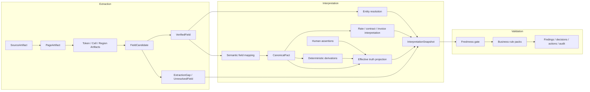

# Generic OCR and Extraction Architecture — Phase 2 Design

**Design date:** 2026-07-23
**Status:** Design only. No production code, tests, fixtures, migrations, scripts, or persisted data changed.
**Depends on:** `docs/audits/ocr-extraction-hardcoding-phase-1-2026-07-23.md`
**Target phase:** Phase 3 foundation and generic implementation may begin after review. Production cutover/removal acceptance for F-01 through F-04, and Phase 6 parity, are blocked by the source-PDF dependency in §12.

## 1. Decision and architectural invariant

This design adopts the following non-negotiable invariant:

> `CanonicalFact` may only be constructed from `VerifiedField`.
> `VerifiedField` may only be constructed from one or more immutable
> `TokenArtifact`, `CellArtifact`, or `RegionArtifact` records.
> If no `VerifiedField` exists, no `CanonicalFact` exists.

`CanonicalFact` has a deliberately narrow meaning: it is a source-derived machine fact whose value is unchanged from one or more verified source fields. A deterministic calculation and a human assertion are useful truth records, but neither is a `CanonicalFact` and neither can satisfy the source dependency required to create one.

The effective truth available to Interpretation and Validation is therefore a discriminated union:

```ts
type TruthRecord =
  | CanonicalFact
  | DerivedFact
  | HumanAssertion;
```

This resolves the apparent tension between source-only extraction and operator correction:

- machine extraction remains immutable and source-grounded;
- deterministic derivations cite their machine, derived, or human inputs;
- human assertions retain actor, reason, time, target, and supersession history;
- an effective projection may choose the value applicable to a workflow, but it never collapses the records or rewrites their provenance.

### 1.1 Structural enforcement

No single mechanism is sufficient. The invariant is enforced at four boundaries.

#### Type boundary

- Artifact IDs, `VerifiedFieldId`, and `CanonicalFactId` are opaque branded types.
- The `VerifiedField` constructor and brand remain private to `lib/extraction/domain`.
- `CanonicalFact` has no public value-taking constructor.
- The sole canonical factory accepts a non-empty collection of resolved `VerifiedFieldHandle` objects plus a registered semantic mapping rule.
- The factory computes the canonical value from those verified fields; callers cannot supply a replacement value.
- `DerivedFact` and `HumanAssertion` are separate types and cannot be passed where `VerifiedFieldHandle` is required.

#### Module boundary

```text
lib/extraction/**     → shared artifact primitives only
lib/interpretation/** → extraction public contracts/read repositories
lib/validator/**      → interpretation public contracts/read repositories
```

- Extraction cannot import contract, invoice, rate, vendor, project, or validation modules.
- Interpretation cannot import OCR engines or mutate extraction artifacts.
- Validation cannot import extraction engines, raw extraction blobs, or table reconstruction.
- `lib/pipeline/documentPipeline.ts` becomes orchestration only; it owns no domain construction logic.
- ESLint restricted-import rules and architecture tests reject back-edges and production imports from tests, fixtures, samples, scripts, or training data.

#### Runtime boundary

- Every factory resolves IDs from immutable repositories rather than trusting caller JSON.
- Verification replays the ordered transformation list from exact source fragments.
- A field is rejected if fragments are missing, cross-document, cross-snapshot, outside the source hash, geometrically invalid, or unable to reproduce the normalized value.
- AI/vision output without a locatable region and reproducible value remains a rejected candidate and gap.
- Canonical persistence recomputes the fact value from verified inputs and rejects a mismatch.

#### Persistence boundary

- Machine canonical facts have a non-null verified-field dependency enforced by foreign keys and a deferred dependency constraint.
- Additional verified inputs use a dependency join table.
- Machine, derived, and human records live in separate immutable ledgers.
- Append-only triggers reject mutation of completed artifact/snapshot rows. Supersession creates a new record.
- Validation runs pin exact extraction, interpretation, human-assertion-set, and rule-pack versions.
- Compatibility JSON projections are not authoritative inputs.

TypeScript alone cannot prevent a deliberate `as CanonicalFact` cast. The runtime repository and database dependency checks make that cast unable to persist or affect validation.

## 2. One-directional layer architecture



There are no back-edges:

- Extraction does not know document family, contract, rate, vendor, category, project, or business rule.
- Interpretation assigns meaning without altering `VerifiedField.normalized_value`.
- Validation consumes a current `InterpretationSnapshot`, `EffectiveFact` records, and extraction gaps. It cannot recover or substitute raw values.

### 2.1 Current-module disposition

| Current module | Target layer | Required split or change |
|---|---|---|
| `lib/server/documentExtraction.ts` | Extraction orchestration | retain byte/engine orchestration; remove filename/type business routing and semantic typed extraction |
| `lib/extraction/pdf/extractText.ts` | Extraction | emit immutable token/page artifacts with complete geometry |
| `lib/extraction/pdf/ocrGeometryLayout.ts` | Extraction | replace whole-page winner with region-level arbitration |
| `lib/extraction/pdf/extractTables.ts` | Extraction | replace `PdfTable*` with generic physical table artifacts |
| `lib/extraction/pdf/extractForms.ts` | Extraction | emit structural label/value regions and verified primitives |
| `lib/extraction/pdf/partitionWithUnstructured.ts` | Extraction | retain as an engine; persist engine identity and coordinate artifacts |
| `lib/extraction/pdf/mapUnstructuredElements.ts` | Extraction | map into the common artifact model |
| `lib/extraction/pdf/visionRateTableSupplement.ts` | Extraction | rename/rewrite as generic region transcription; remove rate semantics and authored headers |
| `lib/extraction/pdf/buildEvidenceMap.ts` | Compatibility adapter | project immutable artifacts into legacy evidence only; not authoritative |
| `lib/extraction/evidenceValueMatch.ts` | Retire/split | opportunistic literal matching cannot prove a fact; a generic span locator may produce candidates inside Extraction only |
| `lib/server/extractionNormalizer.ts` | Compatibility adapter | stop originating fixed-confidence rows; project canonical IDs and lineage |
| `lib/ai/instructor/extractionAssist.ts` | Split | source citation/verification becomes an Extraction candidate adapter; semantic field selection belongs to Interpretation; unlocated output is rejected |
| `lib/ai/instructor/classifyDocumentFamily.ts` | Interpretation | classify from verified content only; remove filename/title/stored-type scoring |
| `lib/pipeline/nodes/extractNode.ts` | Extraction reader | load source/run/artifacts only; move family inference out |
| `lib/pipeline/nodes/normalizeNode.ts` | Split | primitive verification moves to Extraction; semantic keys, invoice/contract meaning, derived fields, and category logic move to Interpretation; synthetic evidence is deleted |
| `lib/operationalTables/canonicalOperationalTableRowAssembler.ts` | Split | geometry/fragments move to Extraction; business row roles and meanings move to Interpretation |
| `lib/contracts/contractRateScheduleRows.ts` | Interpretation after rewrite | consume verified table/header/cell fields; remove all document-specific builders, fingerprints, and authored recovery |
| `lib/contracts/exhibitARateTableRows.ts` | Split/remove | generic geometry moves to Extraction; Exhibit/page-specific logic is removed |
| `lib/contracts/contractPricingAssembly.ts` | Interpretation | attach rate/category/display interpretations; never overwrite observed fields; remove correction maps/count/table-ID rules |
| `lib/contracts/analyzeContractIntelligence.ts` | Interpretation | consume canonical facts and interpreted schedules only |
| `lib/invoices/invoiceParser.ts` | Interpretation after split | consume verified primitives; raw text/table candidate creation moves to Extraction |
| `lib/invoices/invoiceCanonicalNames.ts` | Interpretation entity resolution | delete contractor literal branch; use versioned tenant entity registry |
| `lib/contracts/contractorIdentity.ts` | Interpretation entity resolution | stop rewriting `PipelineFact.value`; emit separate resolution object |
| `lib/documentIntelligence.ts` | Interpretation/read projection | remove filename/title semantic routing and database project-name extraction |
| `lib/server/intelligenceAdapter.ts` | Interpretation compatibility projection | write stamped read projections, not canonical source data |
| `lib/server/intelligencePersistence.ts` | Orchestration/persistence | persist immutable interpretation snapshot and compact compatibility pointers |
| `lib/pipeline/processDocument.ts` | Application orchestration | sequence source ingest, immutable extraction publication, Interpretation, projection, and validation; own no value construction |
| `lib/pipeline/documentPipeline.ts` | Application orchestration | replace mixed node execution with one-way layer calls and typed snapshot handles |
| `lib/effectiveFacts.ts` | Shared truth projection | preserve discriminated provenance records; no array/source flattening |
| `lib/projectFacts.ts` | Shared truth projection | consume current effective truth, not legacy extraction/summary blobs |
| `lib/validator/projectValidator.ts` | Validation | accept only fresh interpretation/effective inputs; delete raw recovery, reanalysis, persisted-row count preference, and summary fallback |
| `lib/validator/persistValidationRun.ts` | Validation | persist dependency IDs and full source navigation refs |

The target package shape is:

```text
lib/extraction/domain/**
lib/extraction/runtime/**
lib/extraction/pdf/**
lib/extraction/persistence/**

lib/interpretation/canonical/**
lib/interpretation/contracts/**
lib/interpretation/invoices/**
lib/interpretation/rates/**
lib/interpretation/entities/**
lib/interpretation/persistence/**

lib/validator/**
```

## 3. Field-provenance contract

### 3.1 Shared primitives

```ts
type NonEmpty<T> = readonly [T, ...T[]];

type SourceArtifactId = string & { readonly __sourceArtifactId: unique symbol };
type ExtractionRunId = string & { readonly __extractionRunId: unique symbol };
type PageArtifactId = string & { readonly __pageArtifactId: unique symbol };
type FragmentArtifactId = string & { readonly __fragmentArtifactId: unique symbol };
type FieldCandidateId = string & { readonly __fieldCandidateId: unique symbol };
type VerifiedFieldId = string & { readonly __verifiedFieldId: unique symbol };
type CanonicalFactId = string & { readonly __canonicalFactId: unique symbol };

interface BoundingBox {
  readonly coordinate_space: 'page_normalized';
  readonly origin: 'top_left';
  readonly x0: number; // inclusive, 0..1
  readonly y0: number; // inclusive, 0..1
  readonly x1: number; // exclusive, 0..1
  readonly y1: number; // exclusive, 0..1
  readonly rotation: 0 | 90 | 180 | 270;
}

type ProcessingStage =
  | 'source_download'
  | 'source_ingest'
  | 'page_render'
  | 'native_text'
  | 'ocr'
  | 'vision'
  | 'partition'
  | 'layout'
  | 'region_arbitration'
  | 'table_reconstruction'
  | 'primitive_parse'
  | 'field_verification'
  | 'interpretation'
  | 'canonical_interpretation'
  | 'persistence';

interface ParserIdentity {
  readonly stage: ProcessingStage;
  readonly name: string;
  readonly version: string;
  readonly configuration_hash: string;
}
```

All boxes use one normalized top-left coordinate space while retaining page dimensions and rotation on `PageArtifact`. Engine-native coordinates may also be retained in artifact metadata for debugging, but normalized geometry is mandatory.

### 3.2 Source and page artifacts

```ts
interface SourceArtifact {
  readonly id: SourceArtifactId;
  readonly organization_id: string;
  readonly source_document_id: string;
  readonly source_sha256: string;
  readonly storage_object_version: string;
  readonly media_type_sniffed: string;
  readonly byte_length: number;
  readonly created_at: string;
}

/**
 * The only source capability visible to parser implementations.
 * Application/document identity is deliberately absent.
 */
interface SourceContentView {
  readonly content_handle: string & {
    readonly __sourceContentHandle: unique symbol;
  };
  readonly source_sha256: string;
  readonly media_type_sniffed: string;
  readonly byte_length: number;
}

interface PageContentView {
  readonly content_handle: string & {
    readonly __pageContentHandle: unique symbol;
  };
  readonly source_sha256: string;
  readonly page_ordinal: number;
  readonly width: number;
  readonly height: number;
  readonly rotation_degrees: 0 | 90 | 180 | 270;
  readonly render_sha256: string;
}

interface PageArtifact {
  readonly id: PageArtifactId;
  readonly extraction_run_id: ExtractionRunId;
  readonly source_artifact_id: SourceArtifactId;
  readonly source_document_id: string;
  readonly source_sha256: string;
  readonly page: number; // one-based source page
  readonly width: number;
  readonly height: number;
  readonly rotation_degrees: 0 | 90 | 180 | 270;
  readonly render_sha256: string;
  readonly parser: ParserIdentity;
  readonly status: 'processed' | 'blank_verified' | 'partial' | 'failed';
  readonly gap_ids: readonly string[];
}
```

`source_sha256` is computed from exact uploaded bytes. Filename, title, project, document ID, contractor, and operator-selected type are metadata for the application, not extraction routing signals.

Parsers receive only `SourceContentView` and `PageContentView`. Orchestration and
persistence own the `source_document_id` association and stamp it onto persisted
artifacts after parsing. A parser therefore cannot branch on document/project identity
even though persisted artifacts retain that identity for lineage.

### 3.3 Token, cell, and region artifacts

```ts
interface ArtifactBase {
  readonly id: FragmentArtifactId;
  readonly extraction_run_id: ExtractionRunId;
  readonly page_artifact_id: PageArtifactId;
  readonly source_document_id: string;
  readonly page: number;
  readonly bounding_box: BoundingBox;
  readonly raw_text: string;
  readonly parser: ParserIdentity;
}

interface TokenArtifact extends ArtifactBase {
  readonly kind: 'token';
  readonly recognition_confidence: number | null;
  readonly reading_order: number;
}

interface CellArtifact extends ArtifactBase {
  readonly kind: 'cell';
  readonly content_token_ids: readonly FragmentArtifactId[];
  readonly structural_evidence_ids: NonEmpty<FragmentArtifactId>;
  readonly table_segment_id: FragmentArtifactId;
  readonly row_start: number;
  readonly row_span: number;
  readonly column_start: number;
  readonly column_span: number;
  readonly line_break_offsets: readonly number[];
}

interface LayoutSignalArtifact extends ArtifactBase {
  readonly kind: 'layout_signal';
  readonly signal_type:
    | 'ruling_line'
    | 'whitespace_gutter'
    | 'alignment_band'
    | 'typographic_boundary';
}

interface RegionArtifact extends ArtifactBase {
  readonly kind: 'region';
  readonly child_fragment_ids: NonEmpty<FragmentArtifactId>;
  readonly region_role:
    | 'text_block'
    | 'table'
    | 'table_row'
    | 'header'
    | 'footer'
    | 'form_region'
    | 'image_text'
    | 'unknown';
}

type SourceFragmentArtifact =
  | TokenArtifact
  | CellArtifact
  | LayoutSignalArtifact
  | RegionArtifact;
```

Every artifact is append-only. `raw_text` is exact engine output for that source span. Competing engine artifacts coexist; arbitration creates a decision artifact rather than deleting alternatives.

### 3.4 Candidates, transformations, and verified fields

Extraction knows primitive/structural value kinds only:

```ts
type NormalizedPrimitive =
  | { readonly type: 'text'; readonly value: string }
  | { readonly type: 'decimal'; readonly value: string }
  | { readonly type: 'date'; readonly value: string }
  | { readonly type: 'boolean'; readonly value: boolean };

interface TransformationStep {
  readonly sequence: number;
  readonly operation:
    | 'unicode_nfkc'
    | 'collapse_whitespace'
    | 'normalize_line_breaks'
    | 'join_ordered_fragments'
    | 'strip_currency_symbol'
    | 'remove_group_separator'
    | 'decimal_parse'
    | 'date_parse'
    | 'ocr_glyph_substitution';
  readonly implementation_version: string;
  readonly input_sha256: string;
  readonly output_sha256: string;
  readonly input_text: string;
  readonly output_text: string;
  readonly lossless: boolean;
  readonly rationale: string;
}

interface FieldCandidate {
  readonly id: FieldCandidateId;
  readonly extraction_run_id: ExtractionRunId;
  readonly source_document_id: string;
  readonly source_fragment_ids: NonEmpty<FragmentArtifactId>;
  readonly raw_text: string;
  readonly primitive_kind: NormalizedPrimitive['type'];
  readonly proposed_value: NormalizedPrimitive;
  readonly transformations: readonly TransformationStep[];
  readonly parser: ParserIdentity;
  readonly confidence: ExtractionConfidence;
  readonly status: 'candidate' | 'rejected' | 'ambiguous';
  readonly gap_ids: readonly string[];
}

interface VerifiedField {
  readonly id: VerifiedFieldId;
  readonly extraction_run_id: ExtractionRunId;
  readonly source_document_id: string;
  readonly source_fragment_ids: NonEmpty<FragmentArtifactId>;
  readonly raw_text: string;
  readonly normalized_value: NormalizedPrimitive;
  readonly transformations: readonly TransformationStep[];
  readonly parser: ParserIdentity;
  readonly verifier: ParserIdentity;
  readonly confidence: ExtractionConfidence;
  readonly candidate_id: FieldCandidateId;
}
```

The verifier:

1. resolves every fragment;
2. checks one source document, source artifact, run, and parser manifest;
3. validates non-empty, in-page boxes;
4. reconstructs `raw_text` in declared order;
5. replays the registered transformation operations;
6. confirms the final value exactly matches `normalized_value`;
7. calculates confidence from referenced evidence;
8. either creates `VerifiedField` or records an `UnresolvedField`/`ExtractionGap`.

`ocr_glyph_substitution` may propose an alternate only through a generic, versioned character-confusion rule. It retains before/after text and cannot use a known business value to choose the result.

A glyph-substitution candidate cannot verify from that generic confusion rule alone.
The substituted glyph must also be supported by an independent source artifact
(another extraction engine) or a versioned source-pixel classifier tied to the exact
bounding box. Without that corroboration the candidate remains ambiguous.

### 3.5 Canonical, derived, and human truth types

```ts
interface CanonicalFact {
  readonly id: CanonicalFactId;
  readonly provenance_class: 'machine_extraction';
  readonly key: string;
  readonly value: NormalizedPrimitive;
  readonly primary_verified_field_id: VerifiedFieldId;
  readonly supporting_verified_field_ids: readonly VerifiedFieldId[];
  readonly interpretation_rule: {
    readonly id: string;
    readonly version: string;
  };
  readonly confidence: StructuredConfidence;
  readonly created_at: string;
}

type TruthDependency =
  | {
      readonly provenance_class: 'machine_extraction';
      readonly canonical_fact_id: CanonicalFactId;
    }
  | {
      readonly provenance_class: 'deterministic_derivation';
      readonly derived_fact_id: string;
    }
  | {
      readonly provenance_class: 'human_assertion';
      readonly human_assertion_id: string;
    };

interface DerivedFact {
  readonly id: string;
  readonly provenance_class: 'deterministic_derivation';
  readonly key: string;
  readonly value: NormalizedPrimitive;
  readonly rule_id: string;
  readonly rule_version: string;
  readonly input_dependencies: NonEmpty<TruthDependency>;
  readonly calculation_trace: readonly TransformationStep[];
  readonly created_at: string;
}

interface HumanAssertion {
  readonly id: string;
  readonly provenance_class: 'human_assertion';
  readonly key: string;
  readonly asserted_value: NormalizedPrimitive | null;
  readonly target_machine_fact_id: CanonicalFactId | null;
  readonly target_verified_field_id: VerifiedFieldId | null;
  readonly source_binding: 'source_bound' | 'domain_assertion';
  readonly supersedes_assertion_id: string | null;
  readonly actor_id: string;
  readonly reason: string;
  readonly asserted_at: string;
  readonly status: 'active' | 'superseded' | 'needs_review';
}
```

The only machine factory is:

```ts
createCanonicalFact({
  key,
  verifiedFields,
  interpretationRuleId,
});
```

It has no `value` parameter. A registered interpretation rule may choose which verified primitive supplies the semantic key, but it cannot alter that primitive. Business enrichments such as category or resolved vendor are separate interpretation records.

`CanonicalFact.value` must equal
`primary_verified_field.normalized_value` exactly. Supporting verified fields may
prove a label, header, or context, but they cannot be combined to manufacture a
different value. If multiple candidate fields disagree, Interpretation emits an
ambiguity record and no canonical fact for that key.

### 3.6 Persistence model

Phase 3 should introduce replay-safe, organization-scoped tables:

| Record | Authoritative persistence |
|---|---|
| source bytes identity | `extraction_source_artifacts` |
| parser manifest/run | `extraction_runs` |
| page artifacts | `extraction_page_artifacts` |
| tokens/cells/regions/arbitration | `extraction_fragment_artifacts` |
| candidates, including rejected/ambiguous | `extraction_field_candidates` |
| verified fields | `extraction_verified_fields` |
| verified field → fragment dependencies | `extraction_verified_field_sources` |
| canonical machine facts | `canonical_document_facts` |
| canonical fact → verified field dependencies | `canonical_document_fact_sources` |
| deterministic derivations | `derived_document_facts` and dependency table |
| human truth | append-only `human_fact_assertions` or an evolved immutable review/override ledger |
| interpretation outputs | `document_interpretation_snapshots` and typed interpretation records |
| entity enrichment | `entity_resolution_runs` and `entity_resolutions` |

Large page renders and engine-native payloads are stored content-addressed in object storage; database rows store immutable manifests, hashes, geometry, text required for navigation, and dependency IDs.

All new tables require organization scoping, RLS, append-only protection, source/run indexes, dependency foreign keys, and fresh-database replay tests. Phase 2 does not prescribe migration filenames or modify schema.

### 3.7 Existing structure mapping

| Existing structure | Target treatment |
|---|---|
| `evidence_v1` | compatibility projection from fragment artifacts; never authoritative |
| `document_extractions.data` | legacy historical blob; new snapshots may expose a compact compatibility projection |
| normalized `document_extractions` field rows | projection from canonical facts with canonical/verified IDs; no fixed confidence |
| `contract_analysis` | immutable Interpretation output referencing canonical facts, derived facts, and enrichment IDs |
| `documents.intelligence_trace` | compact read projection stamped with source/run/snapshot IDs |
| effective facts | provenance-preserving projection over three ledgers |
| `projects.validation_summary_json` | presentation summary only; never validation input |
| validation evidence | dependency references to truth records, verified fields, fragments, page, box, raw text, and parser |

### 3.8 Phase 1 lineage gaps closed

The contract closes every §8 gap:

- native/OCR/vision alternatives remain immutable rather than being discarded;
- cells retain x/y bounds, spans, token identities, engine identity, and confidence;
- standard evidence navigation projects full boxes;
- AI fields require verified spans and replayable transformations;
- no synthetic page 1 or fixed confidence can pass verification;
- normalized rows retain canonical and verified IDs;
- value-text matching cannot create semantic proof;
- row-level anchors are replaced by field dependencies;
- `contract_analysis` references immutable interpretation inputs;
- trace and summary JSON are projections rather than source truth;
- effective facts preserve per-record class and dependency identity;
- validation evidence closes to the exact extraction snapshot and source bytes.

## 4. Provenance-class separation

### 4.1 Mutually exclusive stores

| Class | Origin | May create `CanonicalFact`? | Mutation model |
|---|---|---:|---|
| `machine_extraction` | verified source fragments | yes, through the sole factory | immutable; new parser/source creates a new snapshot |
| `deterministic_derivation` | cited truth inputs and versioned rule | no | immutable; recompute on input/rule change |
| `human_assertion` | authenticated operator/API action | no | append-only; correction supersedes prior assertion |

Database constraints reject:

- human/derived IDs in canonical-fact source dependency tables;
- machine records without verified-field dependencies;
- human assertions without actor, reason, and provenance binding;
- derived records without non-empty dependencies and rule version.

### 4.2 Merge and effective selection

`EffectiveFact` is a selection record, not a rewritten fact:

```ts
interface EffectiveFact {
  readonly key: string;
  readonly selected: TruthRecord;
  readonly candidates: NonEmpty<TruthRecord>;
  readonly selection_rule_id: string;
  readonly selection_rule_version: string;
  readonly selection_reason: string;
}
```

- scalar selection retains all candidate IDs;
- arrays retain source identity per row and per field; they are never unioned and then labeled with a single winning source;
- human correction can be selected over a machine value but the machine record remains visible;
- confirmation references the existing machine fact and never changes its class/confidence;
- a correction to a missing extracted field remains a human assertion, not synthetic extraction;
- replay can mark a source-bound assertion `needs_review`, but cannot silently copy it into the new machine snapshot.

### 4.3 Display contract

Every UI/validator evidence view must show:

- effective value;
- provenance class;
- machine observed value, if present;
- derivation rule and inputs, if derived;
- actor/reason/time and superseded machine value, if human;
- source page/bbox/raw text for machine dependencies;
- snapshot and parser version.

Manual invoice-rate links remain human interpretation records referencing both the invoice-line verified fields and the selected interpreted schedule row. They never inject a rate, unit, or description into machine extraction.

## 5. Stale-trace replay and invalidation

### 5.1 Snapshot identity

At upload, exact bytes are streamed through SHA-256 before parsing. Storage ETag is diagnostic only.

```ts
interface VersionedComponent {
  readonly name: string;
  readonly version: string;
  readonly configuration_hash: string;
}

interface ParserManifest {
  readonly artifact_schema_version: string;
  readonly renderer: VersionedComponent;
  readonly native_pdf_extractor: VersionedComponent;
  readonly ocr: VersionedComponent;
  readonly partition: VersionedComponent | null;
  readonly layout: VersionedComponent;
  readonly region_arbitration: VersionedComponent;
  readonly table_parser: VersionedComponent;
  readonly vision: VersionedComponent | null;
  readonly typed_ai: VersionedComponent | null;
  readonly primitive_normalizers: readonly VersionedComponent[];
  readonly verification_policy: VersionedComponent;
}

interface ExtractionRun {
  readonly id: ExtractionRunId;
  readonly semantic_key: string;
  readonly attempt_number: number;
  readonly source_artifact_id: SourceArtifactId;
  readonly parser_manifest_hash: string;
  readonly artifact_schema_version: string;
  readonly status: 'running' | 'complete' | 'partial' | 'failed';
  readonly started_at: string;
  readonly completed_at: string | null;
}

interface ExtractionSnapshot {
  readonly id: string;
  readonly source_document_id: string;
  readonly source_artifact_id: SourceArtifactId;
  readonly source_sha256: string;
  readonly parser_manifest_hash: string;
  readonly artifact_schema_version: string;
  readonly producing_run_id: ExtractionRunId;
  readonly status: 'complete' | 'partial';
  readonly content_extraction_fingerprint: string;
  readonly artifact_root_hash: string;
  readonly gap_ids: readonly string[];
  readonly published_at: string;
}

interface InterpretationSnapshot {
  readonly id: string;
  readonly extraction_snapshot_id: string;
  readonly interpreter_manifest_hash: string;
  readonly entity_resolver_version: string;
  readonly effective_truth_set_hash: string;
  readonly extraction_gap_ids: readonly string[];
  readonly status: 'complete' | 'partial' | 'blocked';
  readonly output_root_hash: string;
  readonly published_at: string;
}
```

The parser version is the SHA-256 of canonical manifest JSON, including every model, prompt, schema, language asset, configuration, and feature flag that can affect output. It is not a hand-maintained label.

An attempt-scoped `ExtractionRun` is distinct from a publishable snapshot. The
semantic snapshot key is exactly:

```text
source_document_id
+ source_artifact_id
+ parser_manifest_hash
+ artifact_schema_version
```

There is one compare-and-swap-published snapshot for that semantic key. Failed or
partial retries remain runs and cannot become alternate current snapshots. A retry
may publish only if no completed semantic snapshot exists. A corrupt published snapshot
is quarantined through an appended invalidation record and rebuilt under a corrected,
new manifest or artifact-schema key.

The snapshot table has a unique constraint on that semantic key. A separate mutable
current-pointer/rollout-assignment row selects the exact desired manifest and published
snapshot for each document; changing eligibility never mutates the snapshot.

Completed snapshot contents never change. A root hash covers the canonical ordering of
page artifacts, fragments, candidates, verified fields, and gaps. Artifact/root hashing
uses content-addressed dependency hashes, not random database primary keys.

`content_extraction_fingerprint` excludes tenant/document associations and database IDs.
It covers source bytes, parser manifest, content-derived artifacts, transformations,
verified values, and gaps. This is the value used for same-bytes invariance.

Interpretation has its own immutable snapshot keyed by:

```text
extraction_snapshot_id
+ interpreter_manifest_hash
+ entity_registry/resolver version
```

Validation records:

- extraction snapshot IDs;
- interpretation snapshot IDs;
- human assertion set version;
- rule-pack and validation code versions;
- relationship/precedence fingerprint.

### 5.2 Cache keys

```text
page render:
  source_sha256 + page + render_config_digest

engine artifact:
  page_render_sha256 + engine name/version/config digest

table artifact:
  ordered region artifact digest + table parser version/config digest

field artifact:
  ordered fragment digest + primitive parser version + schema version
```

No key may contain filename, title, project, document ID, invoice/contract number, contractor, expected output, or known row count. Identical-byte computation sharing is permitted only within an authorized tenant boundary, and every upload retains its own `source_document_id` association.

### 5.3 Invalidation and replay

1. Publish a deterministic desired parser-manifest assignment per document/cohort.
2. Append an invalidation/current-pointer change and mark only mutable compatibility projections stale; completed snapshots remain immutable.
3. Enqueue one idempotent replay for each current source/manifest key.
4. Parse exact source bytes; never seed from old rows or `contract_analysis`.
5. Integrity-check and compare-and-swap publish the one semantic extraction snapshot.
6. Rebuild Interpretation and effective projections.
7. trigger validation pinned to the new snapshots.

A source-byte change follows the same sequence because `current_source_artifact_id` changes.

Compatibility projections (`document_extractions`, normalized rows, `contract_analysis`, `intelligence_trace`, project summary) carry:

```text
source_artifact_id
source_sha256
extraction_snapshot_id
parser_manifest_hash
interpretation_snapshot_id
projection_schema_version
```

Legacy rows without complete stamps are `legacy_unverifiable`: historical and readable, but ineligible for current truth.

### 5.4 Validator freshness gate

Before executing business rules, Validation requires:

- current source artifact and SHA-256;
- exactly the published extraction snapshot for the document's assigned parser manifest;
- supported artifact schema;
- `complete` for approval-, payment-, exposure-, absence-, or completeness-sensitive validation;
- valid root/dependency integrity;
- every `CanonicalFact` dependency closing to verified fields and source artifacts;
- the published Interpretation snapshot targeting that exact extraction snapshot.

Failure produces an input finding:

```text
STALE_EXTRACTION_SNAPSHOT
MISSING_EXTRACTION_SNAPSHOT
UNSUPPORTED_ARTIFACT_SCHEMA
EXTRACTION_GAP
INTERPRETATION_SNAPSHOT_MISMATCH
```

The validation run becomes `blocked_inputs`/`incomplete`. Dependent rules cannot return PASS and approval cannot consume the run.

Validation must not:

- read raw `document_extractions` to recover truth;
- prefer persisted rows because there are more of them;
- synthesize a contract document from flattened facts;
- rerun contract/invoice interpretation internally;
- fall back to `validation_summary_json`;
- use an old successful run after a source/parser version change.

A controlled canary may assign different compliant generic manifests to deterministic
document/cohort partitions. Each document has exactly one desired manifest, and the
validator requires that exact assignment; membership in a broad accepted set is not
enough. Rollback changes the assignment to a prior compliant manifest and replays source
bytes. A legacy hardcoded manifest is never assignable. If no compliant prior manifest
exists, affected validation pauses.

### 5.5 Human truth during replay

- Source-bound human assertions reference the source artifact and machine fact/verified field they supersede.
- A source or snapshot change marks them `needs_review` unless stable evidence identity can be deterministically rebound and policy permits it.
- Domain assertions intentionally independent of source bytes remain in the human ledger.
- Manual rate links must rebind through verified evidence identity, not description/rate equality; otherwise they become `needs_review`.
- No human value is copied into a replayed extraction snapshot.

## 6. Generic table and layout model

Extraction reconstructs physical structure and primitive value kinds only. Interpretation decides that a column means description, quantity, unit, rate, or extension.

```ts
type TableValueKind =
  | 'free_text'
  | 'identifier'
  | 'integer'
  | 'decimal'
  | 'currency'
  | 'date_like'
  | 'unit_token'
  | 'boolean_like'
  | 'unknown';

interface GridCellArtifact extends CellArtifact {
  readonly structure:
    | 'ordinary'
    | 'merged'
    | 'row_spanning'
    | 'column_spanning'
    | 'continuation'
    | 'empty_observed';
  readonly border_evidence: {
    readonly top: BorderSignal;
    readonly right: BorderSignal;
    readonly bottom: BorderSignal;
    readonly left: BorderSignal;
  };
}

type BorderSignal = 'ruling' | 'whitespace' | 'alignment' | 'none';

interface MeasuredScore {
  readonly value: number;
  readonly calculator: ParserIdentity;
  readonly basis_artifact_ids: NonEmpty<FragmentArtifactId>;
  readonly diagnostics: readonly string[];
}

type HeaderObservation =
  | {
      readonly observed_text: string;
      readonly normalized_label: string;
      readonly fragment_ids: NonEmpty<FragmentArtifactId>;
      readonly transformations: readonly TransformationStep[];
    }
  | {
      readonly observed_text: null;
      readonly normalized_label: null;
      readonly fragment_ids: readonly [];
      readonly transformations: readonly [];
    };

interface LogicalTableRow extends RegionArtifact {
  readonly region_role: 'table_row';
  readonly cell_ids: readonly FragmentArtifactId[];
  readonly kind:
    | 'header'
    | 'data'
    | 'section_header'
    | 'continuation'
    | 'footer'
    | 'unknown';
  readonly continued_from_row_id: FragmentArtifactId | null;
  readonly fragment_ids: NonEmpty<FragmentArtifactId>;
}

interface ColumnStructureHypothesis {
  readonly index: number;
  readonly x0: number;
  readonly x1: number;
  readonly header: HeaderObservation;
  readonly value_kind_hypotheses: NonEmpty<{
    readonly kind: TableValueKind;
    readonly measurement: MeasuredScore;
  }>;
}

interface TableSegmentArtifact extends RegionArtifact {
  readonly region_role: 'table';
  readonly column_hypotheses: readonly ColumnStructureHypothesis[];
  readonly row_ids: NonEmpty<FragmentArtifactId>;
  readonly repeated_header_row_ids: readonly FragmentArtifactId[];
  readonly parent_segment_id: FragmentArtifactId | null;
  readonly detection_evidence: NonEmpty<{
    readonly kind:
      | 'ruling_lines'
      | 'x_alignment'
      | 'whitespace_gutters'
      | 'repeated_headers'
      | 'typographic_grouping';
    readonly basis_artifact_ids: NonEmpty<FragmentArtifactId>;
    readonly calculator: ParserIdentity;
  }>;
}

interface TableContinuationLink {
  readonly id: string;
  readonly extraction_run_id: ExtractionRunId;
  readonly source_document_id: string;
  readonly parser: ParserIdentity;
  readonly from_segment_id: FragmentArtifactId;
  readonly to_segment_id: FragmentArtifactId;
  readonly basis: {
    readonly column_band_similarity: MeasuredScore;
    readonly header_similarity: MeasuredScore | null;
    readonly edge_proximity: MeasuredScore;
    readonly typography_similarity: MeasuredScore;
    readonly row_continuation_score: MeasuredScore;
  };
  readonly score: MeasuredScore;
  readonly decision: 'linked' | 'ambiguous' | 'rejected';
}

interface TableChainArtifact {
  readonly id: string;
  readonly extraction_run_id: ExtractionRunId;
  readonly source_document_id: string;
  readonly parser: ParserIdentity;
  readonly segment_ids: NonEmpty<FragmentArtifactId>;
  readonly continuation_links: readonly TableContinuationLink[];
  readonly section_ids: readonly string[];
  readonly completeness: 'complete' | 'partial' | 'ambiguous';
  readonly gap_ids: readonly string[];
}

interface TableSectionArtifact {
  readonly id: string;
  readonly extraction_run_id: ExtractionRunId;
  readonly source_document_id: string;
  readonly parser: ParserIdentity;
  readonly table_chain_id: string;
  readonly header_row_id: FragmentArtifactId | null;
  readonly member_row_ids: NonEmpty<FragmentArtifactId>;
  readonly child_table_chain_ids: readonly string[];
}

interface SemanticColumnMapping {
  readonly id: string;
  readonly interpretation_snapshot_id: string;
  readonly table_chain_id: string;
  readonly column_index: number;
  readonly domain_role:
    | 'description'
    | 'quantity'
    | 'unit'
    | 'rate'
    | 'extension'
    | 'identifier'
    | 'other';
  readonly header_verified_field_ids: readonly VerifiedFieldId[];
  readonly cell_verified_field_ids: NonEmpty<VerifiedFieldId>;
  readonly assessment: InterpretationAssessment;
  readonly status: 'resolved' | 'ambiguous';
}
```

Rows/segments persist as fragment artifacts; links, chains, and sections persist as
immutable table-structure artifacts with explicit run/source/parser identities. Snapshot
publication rejects a chain containing dependencies from another run, source hash,
manifest, or attempt.

### 6.1 Required behavior

- **Column roles:** Extraction records observed headers, geometry, and primitive kinds. Interpretation emits a `SemanticColumnMapping` referencing header and cell verified fields. It may label a column `rate`, but cannot change any cell value.
- **Merged cells:** one cell retains all fragments and explicit `row_span`/`column_span`; text is not copied into neighboring rows.
- **Multiline rows:** one physical cell retains line break offsets and ordered fragments.
- **Subtables:** represented by `TableSectionArtifact`, explicit member rows, and child chain IDs.
- **Cross-page continuation:** linked by column-band, header, edge, typography, and
  row-continuation measurements. Physical page adjacency/order and top/bottom edge
  proximity are valid layout evidence; fixed page literals and document-family page
  assumptions are forbidden. Table IDs are never semantic inputs.
- **Single-row tables:** valid; no minimum row count.
- **Pass-through-only schedules:** retain exact text VerifiedFields; absence of numeric cells is not rejection.
- **Missing borders:** use alignment, whitespace gutters, typography, repeated headers, and ruling lines as evidence components.
- **Section headers/categories:** remain separate source fields. Interpretation may reference them; Extraction does not copy category text into rows.
- **Completeness:** derived from processed region coverage and link ambiguity, never expected cardinality.

The current `PdfTableCell`, `PdfTableRow`, and `PdfTable` types are retained only behind a compatibility adapter during transition because they cannot represent complete geometry, spans, fragment lineage, or cross-page structure.

### 6.2 Native/OCR/vision arbitration

```ts
interface RegionCandidate extends RegionArtifact {
  readonly ordered_token_ids: NonEmpty<FragmentArtifactId>;
  readonly engine_reported_confidence: number | null;
  readonly quality_signals: {
    readonly glyph_validity: MeasuredScore;
    readonly geometry_coverage: MeasuredScore;
    readonly reading_order_consistency: MeasuredScore;
    readonly image_text_coverage: MeasuredScore | null;
  };
}

interface ArbitrationDecision {
  readonly id: string;
  readonly extraction_run_id: ExtractionRunId;
  readonly source_document_id: string;
  readonly page_artifact_id: PageArtifactId;
  readonly parser: ParserIdentity;
  readonly physical_region_id: FragmentArtifactId;
  readonly candidate_ids: NonEmpty<FragmentArtifactId>;
  readonly accepted_candidate_ids: readonly FragmentArtifactId[];
  readonly rejected_candidate_ids: readonly FragmentArtifactId[];
  readonly agreement: MeasuredScore | null;
  readonly decision: 'consensus' | 'single_source' | 'conflict' | 'unresolved';
  readonly diagnostics: readonly string[];
}
```

Policy:

1. run native token extraction on every page work unit;
2. measure quality per region;
3. OCR weak/image-only regions, independent of filename, type, project, vendor, and page number;
4. retain all native/OCR candidates;
5. compare candidates only on the same page when box IoU/containment meets the
   versioned arbitration threshold in the parser manifest;
6. create consensus only when text is exact or equivalent under permitted normalization;
7. select a single winner only when its measured quality exceeds every conflicting
   candidate by the manifest's minimum margin and no conflicting high-quality candidate
   remains; otherwise persist conflict/unresolved;
8. use vision only as a third transcription source for unresolved regions;
9. require vision/AI page polygon and exact supporting text;
10. reject ungrounded output before `FieldCandidate`.

Initial `region-arbitration-v1` defaults are IoU `>= 0.50` or containment `>= 0.80`
for candidate comparison, a winner-quality margin `>= 0.15`, and high-quality conflict
threshold `>= 0.75`. These values are manifest-versioned and must be calibrated; changing
them changes the parser manifest and invalidates downstream snapshots.

An unresolved conflict creates a gap. A low confidence score never authorizes a guessed value.

## 7. Structured confidence semantics

Confidence describes evidence quality; it does not replace evidence.

```ts
type ConfidenceComponent =
  | {
      readonly state: 'observed';
      readonly score: number;
      readonly basis_artifact_ids: NonEmpty<FragmentArtifactId>;
      readonly diagnostics: readonly string[];
    }
  | {
      readonly state: 'not_available' | 'not_applicable';
      readonly score: null;
      readonly basis_artifact_ids: readonly [];
      readonly diagnostics: readonly string[];
    };

interface ExtractionConfidence {
  readonly version: 'extraction-confidence-v1';
  readonly recognition: ConfidenceComponent;
  readonly geometry_alignment: ConfidenceComponent;
  readonly parse_normalization: ConfidenceComponent;
  readonly cross_engine_agreement: ConfidenceComponent;
  readonly overall: number;
  readonly grade: 'high' | 'medium' | 'low';
  readonly uncertainties: readonly (
    | 'single_engine_only'
    | 'engine_disagreement'
    | 'ambiguous_numeric_parse'
    | 'partial_region'
    | 'missing_neighbor_context'
  )[];
}

interface InterpretationAssessment {
  readonly version: 'interpretation-confidence-v1';
  readonly verified_field_ids: NonEmpty<VerifiedFieldId>;
  readonly header_role: ConfidenceComponent;
  readonly arithmetic_consistency: ConfidenceComponent;
  readonly uncertainties: readonly (
    | 'ambiguous_column_role'
    | 'arithmetic_mismatch'
  )[];
}

/**
 * Read-only composition. It does not mutate ExtractionConfidence.
 */
interface StructuredConfidence {
  readonly version: 'composed-confidence-v1';
  readonly extraction: ExtractionConfidence;
  readonly interpretation: InterpretationAssessment;
  readonly overall: number;
  readonly grade: 'high' | 'medium' | 'low';
  readonly uncertainties: readonly string[];
}
```

Confidence remains immutable across layers:

- Extraction persists `ExtractionConfidence` with `VerifiedField`.
- Interpretation persists a separate `InterpretationAssessment` referencing verified
  field IDs; it cannot alter the extraction envelope.
- A read model composes both into `StructuredConfidence`.
- Validation consumes the composition and applies rule-specific thresholds.

Initial versioned weights:

| Component | Weight |
|---|---:|
| recognition | 0.25 |
| geometry/alignment | 0.20 |
| header-role | 0.15 |
| parse/normalization | 0.20 |
| arithmetic consistency | 0.10 |
| cross-engine agreement | 0.10 |

`observed` components enter the normalized weighted mean. `not_applicable` components
are excluded. `not_available` components are excluded but add a named uncertainty and
apply the versioned component cap. Cross-engine `not_available`, for example, adds
`single_engine_only` and caps overall confidence at `0.85`. Every observed component
requires non-empty basis artifacts. Constructors reject fixed scores without evidence.

Rules:

- source document, page, box, raw text, parser identity, and ordered transformations are hard gates regardless of score;
- single-engine fields are marked and capped at `0.85`;
- material engine conflicts are capped at `0.49` until resolved;
- `high >= 0.85`, `medium >= 0.65`, otherwise `low`;
- arithmetic uses
  `relative_error = abs(extension - quantity * rate) / max(abs(extension), 0.01)`;
  score is `1` when `relative_error <= 0.005`, otherwise
  `clamp(1 - ((relative_error - 0.005) / 0.045), 0, 1)`; operands and tolerance
  policy are versioned and referenced; it is `not_applicable` when operands are absent
  or non-numeric;
- pass-through rows use `not_applicable`, not zero;
- header-role confidence references actual header fragments and band alignment;
- parsing confidence covers only replayable transformations;
- hardcoded corrections never participate.

When a requested field has no supporting span, Extraction emits:

```ts
interface UnresolvedField {
  readonly requested_slot: string;
  readonly reason:
    | 'no_source_span'
    | 'engine_conflict'
    | 'ambiguous_parse'
    | 'missing_geometry'
    | 'unprocessed_region';
  readonly candidate_ids: readonly FieldCandidateId[];
  readonly gap_id: string;
}
```

It emits no value, no `VerifiedField`, and no `CanonicalFact`.

## 8. Performance and failure budgets

These are proposed initial guardrails, not measured repository performance claims. Phase 3 must add instrumentation and representative load tests before treating them as production SLOs.

### 8.1 Stage budgets

| Stage | Initial hard budget |
|---|---:|
| source hash and byte-sniffed MIME | 5 seconds/document |
| PDF metadata/native token extraction | 40 seconds/work unit and 750 ms/page |
| page rendering | 5 seconds/page |
| OCR | 12 seconds/page and 120 seconds/OCR chunk |
| Unstructured | existing 45 seconds/request |
| vision transcription | 20 seconds/region and 90 seconds/chunk |
| region arbitration/layout | 1 second/page |
| table reconstruction | 1 second/page |
| candidate parsing/verification | 10 seconds/work unit |
| Interpretation | 30 seconds/work unit |
| persistence | 30 seconds/work unit |
| one worker attempt | 300 seconds |

### 8.2 Concurrency and work limits

Defaults per document:

- page rendering: 2, global cap 16;
- native layout: 2 pages, global cap 8;
- OCR: `min(2, max(1, floor(logicalCpuCount / 2)))`;
- OCR global cap: 8 pages;
- Unstructured: 1 request, global cap 4;
- vision: 2, with global cap 8;
- typed AI: 2, with global cap 8;
- persistence: one ordered writer per extraction run.

Work limits:

- 40 pages per worker work unit;
- 16 OCR pages per OCR chunk;
- 8 vision regions per vision chunk;
- 2,000 pages or 250 MiB per source as an initial hard intake safety limit;
- stream source hashing and storage reads; at most one full-source buffer when a library requires it;
- 1 GiB per-worker RSS hard ceiling, with oversized inputs routed to a memory-sized worker;
- page images evicted after immutable artifact persistence;
- no whole-document image array retained.

Documents larger than a work unit continue through queued chunks. A chunk cap never means extraction is complete. Sources over the hard intake safety limit fail explicitly as unsupported and require operator action; no partial result is represented as complete.

The scheduler reserves 30 seconds for persistence and 15 seconds for gap/root
finalization inside the 300-second attempt. It admits a stage/chunk only when its
worst-case estimate fits the remaining budget; excess work becomes a continuation.
Thus OCR and vision maxima are not assumed to run sequentially in one overcommitted
attempt.

Transient external failures receive at most two retries with exponential backoff and jitter. Deterministic parsing failures are not retried without a version/configuration change.

Queue policy uses admission backpressure, a 360-second renewable lease with 30-second
heartbeats, at most three worker attempts, and a terminal/dead-letter state that
persists the last gaps and requires operator/replay action. Global memory admission
uses estimated source/render working set, not only task count.

### 8.3 Partial-result semantics

```ts
type ExtractionRunStatus =
  | 'complete'
  | 'partial_retryable'
  | 'partial_terminal'
  | 'failed';

interface ProcessingGap {
  readonly id: string;
  readonly source_document_id: string;
  readonly extraction_run_id: ExtractionRunId;
  readonly page: number | null;
  readonly bounding_box: BoundingBox | null;
  readonly stage: ProcessingStage;
  readonly reason:
    | 'timeout'
    | 'engine_failure'
    | 'unsupported_size'
    | 'unprocessed_region'
    | 'engine_conflict'
    | 'missing_geometry';
  readonly retryable: boolean;
  readonly attempts: number;
  readonly upstream_artifact_ids: readonly FragmentArtifactId[];
}
```

Supported fields from completed regions may be published in a partial snapshot, but:

- every omitted page/region has a persisted gap;
- completeness-dependent interpretation and validation rules block;
- approval-, payment-, exposure-, absence-, and completeness-sensitive rules block;
- partial artifacts may support source inspection and explicitly scoped positive observations only;
- approval never consumes a partial snapshot;
- no stale value fills the missing slot;
- a run is `complete` only when each page is processed or verified blank and no pending/retryable gaps remain.

`blank_verified` requires a successful render plus a versioned blank-page detector whose
decision cites the page image/layout artifacts. Empty native text, OCR failure, timeout,
or missing geometry can never establish blankness.

Budgets may never be met by dropping raw text, geometry, confidence components, alternatives, or transformation history.

### 8.4 Storage and validation efficiency

- persist page/work-unit artifacts incrementally;
- reference common fragments rather than copying raw text into every downstream JSON object;
- keep large table payloads out of `projects.validation_summary_json` and hot document reads;
- validator input queries select immutable snapshot IDs and required typed records, not full legacy blobs;
- batch finding/evidence persistence rather than per-finding replacement loops;
- retain content-addressed artifacts according to a tenant-approved retention policy while preserving hashes/dependency history required for audit;
- record stage duration, queue delay, retry, page count, region count, artifact bytes, cache hit, and gap metrics.

Page/work-unit artifacts may persist incrementally, but a published snapshot root
contains artifacts from exactly one source hash, parser manifest, artifact schema, and
producing run. Fields are never merged across attempts, and no current pointer or read
projection changes before root finalization succeeds.

Cache rules:

- renderer name/version/configuration are included in the render digest;
- OCR/vision/AI model, prompt, schema, language, and preprocessing settings are included
  in engine configuration digests;
- failed/timed-out outputs are never stored as successful immutable artifacts;
- negative cache entries are short-lived, separately typed, and cannot satisfy
  completeness;
- cache reuse creates a fresh upload-to-artifact association for the current
  `source_document_id`.

## 9. Entity resolution as Interpretation enrichment

Extraction returns the exact observed party string:

```text
Observed VerifiedField:
  "Aftermath Disaster Recovery, Inc."
```

It does not canonicalize, alias, or replace it.

### 9.1 Inputs

- one or more source-grounded party-name `VerifiedField`s selected by semantic header/signature interpretation;
- surrounding verified label/signature fields;
- versioned, organization-scoped entity registry and alias records.

Forbidden matching signals:

- filename/title;
- project name;
- document ID;
- expected contractor/vendor;
- historical extraction output;
- hardcoded company branch.

Document ID remains a provenance association only, never a score feature.

### 9.2 Output

```ts
interface EntityResolution {
  readonly id: string;
  readonly provenance_class: 'deterministic_derivation';
  readonly extraction_snapshot_id: string;
  readonly observed_verified_field_id: VerifiedFieldId;
  readonly observed_value: string;
  readonly entity_type: 'vendor' | 'contractor';
  readonly canonical_entity_id: string | null;
  readonly canonical_display_name: string | null;
  readonly candidates: readonly {
    readonly entity_id: string;
    readonly display_name: string;
    readonly alias_ids: readonly string[];
    readonly score: number;
    readonly score_rule_id: string;
    readonly score_rule_version: string;
    readonly basis_verified_field_ids: NonEmpty<VerifiedFieldId>;
    readonly methods: readonly (
      | 'exact_normalized'
      | 'registered_alias'
      | 'fuzzy_text'
      | 'role_context'
    )[];
  }[];
  readonly status: 'resolved' | 'ambiguous' | 'unresolved';
  readonly confidence: StructuredConfidence;
  readonly resolver_version: string;
  readonly registry_version: string;
}
```

Entity resolution is immutable and references the observed field. It never mutates `CanonicalFact.value` or `VerifiedField.normalized_value`.

UI contract:

```text
Observed in source: Aftermath Disaster Recovery, Inc.
Resolved vendor:    Aftermath Disaster Recovery, Inc.
Resolution source:  organization vendor registry
```

If ambiguous or unknown, the observed name remains available and resolution is null. Phase 3 replaces `normalizeInvoiceContractorDisplay`, `inferInvoiceContractorFromPlainText`, and value-rewriting contractor identity logic with this separate layer.

## 10. Ordered Phase 3 removal and cutover plan

The sequence uses shadow generation and freshness gates. It does not delete known paths before their generic replacements and negative tests exist.

### Step 0 — Compliance foundation

**Findings addressed:** prerequisite for F-01 through F-11.

Build:

- opaque artifacts and constructors;
- immutable snapshot stores;
- parser-manifest hashing;
- projection stamps;
- dependency integrity verifier;
- provenance ledgers;
- gaps and run states;
- layer import rules;
- freshness audit/read gates capable of per-document/cohort activation.

Initially dual-write new snapshots while legacy readers remain unchanged.

**Gate:** source-to-field dependency tests, append-only/idempotency tests, exact cache-key tests, canonical factory negative tests, validator freshness tests.

**Rollback:** stop publishing new snapshots. No reader has changed yet.

### Step 1 — Replace synthetic evidence and confidence

**Finding:** F-09.

Replace page-1/fixed confidence, opportunistic value matching, row-wide anchors, and unlocated AI/vision output with span-verified candidates and structured confidence.

**Gate:** every emitted machine field resolves to the same source hash and valid page/bbox/raw span; missing-span and cross-source negative tests; AI/vision citation verification.

**Rollback:** keep new results shadow-only and surface gaps. Do not restore synthetic evidence in the new path.

### Step 2 — Generic OCR and content classification

**Findings:** F-06 and F-07.

Replace filename/type OCR eligibility and fixed page targets with byte/MIME decoding and per-region quality scheduling. Move family classification after Extraction; it consumes source-grounded text/structural fields.

**Gate:** same bytes under arbitrary filename/title/project/document IDs produce the same
`content_extraction_fingerprint` and semantic values modulo provenance association IDs;
moved-table, scanned non-contract, partial-native-page, and all-page scheduling tests.

**Rollback:** use generic full scan or explicit partial gaps. Never use filename or fixed page lists.

After the gate passes, remove `ocrEligible` filename/type selection, metadata-haystack
and stored-type extraction classification, `documentIntelligence` filename/title
semantic routing, pages 1–10 front-matter targeting, and fixed
`[1,2,8,9,10,11]` attachment targeting.

### Step 3 — Generic table artifacts and semantic mapping

**Finding:** F-05.

Introduce complete geometry, spans, multiline/subtable/cross-page artifacts, dynamic observed-header mappings, arbitrary columns, and cardinality-independent acceptance.

**Gate:** bordered/borderless, merged, rowspan/colspan, multiline, subtable, repeated header, cross-page, one-row, pass-through, moved table, reordered column, and arbitrary row-count tests.

**Rollback:** quarantine ambiguous tables and emit gaps. Do not re-enable page/count/table-ID logic in the new path.

After the gate passes, remove `EXHIBIT_A_PAGES`, page/category numeric correction
branches, pages 8–11 generic-parser exclusions, expected category/page counts, exact
table-ID checks, and count-based row downgrading.

### Step 4 — TDOT generic replacement

**Finding:** F-01.

The generic table/interpretation path must independently produce source-grounded fields for each supported TDOT row.

**Must exist first:** Steps 0–3, exact original TDOT PDF, approved artifact handling, parity/metamorphic harness.

**Gate:** dependency closure, zero calls to prohibited builders, reviewed field-level legacy/new diff, mutation tests, no unsupported value emitted.

Then remove `TDOT_APPENDIX_B_SPECS`, split-schedule fingerprints, authored stitcher, and dispatch priority.

Activate fresh-snapshot-only validation for the TDOT cutover cohort atomically with
the generic projection. Persisted legacy traces cannot remain an eligible fallback.

**Rollback:** select a prior compliant generic snapshot or block affected validation. Never restore the authored array as accepted truth.

### Step 5 — MDOT generic replacement

**Finding:** F-02.

The same gates apply to the original MDOT PDF, including source-grounded quantity/rate/extension and arithmetic diagnostics, with the table moved away from page 193.

Remove `MDOT_SECTION_905_PAGE`, specs, value fingerprints, builder, and dispatch.

Activate fresh-snapshot-only validation for the MDOT cutover cohort in the same atomic
cutover.

**Rollback:** prior compliant generic snapshot or blocked validation only.

### Step 6 — Williamson recovery/correction removal

**Findings:** F-03 and F-04.

Region arbitration may verify a value visible in rendered pixels even if one OCR engine misses it, but only with another source artifact carrying bbox/raw transcription. A value absent from all source artifacts remains a gap.

**Must exist first:** original Williamson PDF and Steps 0–3.

**Gate:** mutate every formerly corrected value, confirm the new value follows the source, review every legacy/new difference, and prove no authored recovery value enters the artifact DAG.

Remove `EXHIBIT_A_TEXT_RECOVERY_SPECS`, `recoverMissingExhibitATextRows`, `recoverKnownExhibitADisplayCorrection`, and related special dispatch.

Activate fresh-snapshot-only validation for the Williamson cutover cohort in the same
atomic cutover.

**Rollback:** prior compliant generic snapshot or block; never reinstate correction values.

### Step 7 — Entity-resolution cutover

**Finding:** F-08.

Extraction preserves exact observed party strings. Interpretation publishes separate `EntityResolution` records from a versioned tenant registry.

**Gate:** unknown vendors remain unresolved; ambiguous aliases do not auto-resolve; arbitrary metadata produces identical observed extraction; UI and validator retain observed and resolved values separately.

Remove Aftermath-specific extraction branches and fact-value rewriting.

**Rollback:** display observed source name and mark entity unresolved.

### Step 8 — Human-truth separation

**Finding:** F-11.

Move reviews, overrides, and manual links into append-only human assertion/link records with actor, reason, time, source binding, and supersession.

**Gate:** a human record cannot create/update a verified field, extraction snapshot, or canonical machine fact; replay/rebind, source-change, audit reconstruction, confirmation, correction, and supersession tests pass.

**Rollback:** disable human assertion selection while preserving history; never copy assertions into extraction.

### Step 9 — Validator freshness cutover

**Finding:** F-10.

Complete the global freshness cutover after cohort enforcement in Steps 4–6. Remove
persisted-row-count preference, synthetic contract reanalysis, raw invoice recovery,
and project-summary fallback. Mark unstamped legacy traces `legacy_unverifiable` and
queue replay.

**Gate:** stale/missing/hash/version/schema mismatch blocks; fresh snapshots validate; validation pins all snapshot IDs; approval cannot consume old runs.

**Rollback:** pause validation or select a previous compliant generic manifest. Never accept legacy traces.

Before assigning any cohort to fresh-only validation, the deployment backlog gate
requires: current source bytes retrievable and hash-verified; compliant extraction and
Interpretation snapshots published; human assertions/manual links rebound or marked
`needs_review`; no unresolved required gaps; and a successful validation dry run.
Documents that fail remain blocked. Rollout reporting publishes
pending/complete/partial/failed/blocked replay counts.

### Step 10 — Cleanup and permanent enforcement

**Findings:** residual F-01 through F-11 artifacts.

- retire known-ID reprocessors after source replay completes;
- preserve historical migrations; add a new replay-safe invalidation/replay migration without production IDs or expected counts;
- remove dead imports and tests that protect hardcoded behavior;
- retain historical expected JSON only as clearly test-only diagnostic comparison data;
- enforce production import, forbidden-key, dependency-DAG, same-bytes invariance, absent-span, stale-version, and metamorphic CI guards.

Each Phase 3 commit should contain one finding/group, its replacement, tests, and no unrelated formatting.

## Never Again

### No document-specific builders.

**Type boundary:** Extraction parser inputs expose artifacts, not document identities.
**Module boundary:** Extraction cannot import contract/project/vendor packages.
**Runtime/CI gate:** architecture and AST tests reject production builder registries or branches keyed by document identity.

### No project-specific correction maps.

**Type boundary:** `FieldCandidate` requires source fragments and registered primitive transformations; it accepts no expected value.
**Module boundary:** business constants cannot be imported into Extraction.
**Runtime/CI gate:** verification replays transformations; static checks reject extraction objects combining authored descriptions, units, quantities, rates, or extensions.

### No filename routing.

**Type boundary:** parser-facing `SourceContentView` contains an opaque content handle, source hash, byte length, and byte-sniffed media type—not filename/title/project/type/document identity.
**Module boundary:** metadata classification runs after Extraction.
**Runtime/CI gate:** same-bytes/different-metadata content-fingerprint test is mandatory.

### No page-number assumptions.

**Type boundary:** page is provenance/output, not a semantic parser option. Work-unit page lists are generated by the scheduler from source enumeration and measured quality.
**Module boundary:** business Interpretation cannot configure OCR pages.
**Runtime/CI gate:** lint rejects literal-page-driven semantic selection, OCR scheduling,
table acceptance, normalization, or value correction. Dynamic page enumeration,
bounds, navigation, and physical adjacency remain valid. Moved-table tests are mandatory.

### No table-ID assumptions.

**Type boundary:** `FragmentArtifactId` and table-chain IDs are opaque and only usable as relationship references.
**Module boundary:** semantic mapping consumes table content/geometry, not ID strings.
**Runtime/CI gate:** lint/AST checks reject comparison of artifact IDs with literals.

### No expected row counts.

**Type boundary:** parser APIs have no expected-count input.
**Module boundary:** cardinality is an output diagnostic, not extraction acceptance or Interpretation truth.
**Runtime/CI gate:** architecture tests reject expected-count constants/branches; insert/remove/duplicate tests prove independence.

### No contractor-specific extraction.

**Type boundary:** Extraction emits observed text primitives only.
**Module boundary:** entity registries/resolvers live in Interpretation and cannot be imported by Extraction.
**Runtime/CI gate:** vendor-name invariance and unknown/ambiguous entity tests.

### No recovery values not present in source artifacts.

**Type boundary:** only the private verifier creates `VerifiedField` from non-empty fragment refs.
**Module boundary:** recovery engines may create candidates, not verified values.
**Runtime/CI gate:** transactional source/hash/box/raw/transformation verification; unsupported candidates become gaps.

### No confidence without evidence.

**Type boundary:** every applicable confidence component requires basis artifact IDs.
**Module boundary:** callers cannot submit a scalar confidence to the verifier.
**Runtime/CI gate:** constructor and database reject missing support; fixed-confidence negative tests.

### No CanonicalFact without VerifiedField.

**Type boundary:** opaque `VerifiedFieldHandle`; no public canonical value constructor.
**Module boundary:** one canonical repository/factory.
**Runtime/CI gate:** factory re-resolves dependencies; database requires verified-field FK/dependency closure.

### No machine truth mixed with human truth.

**Type boundary:** discriminated, mutually exclusive record types.
**Module boundary:** separate machine, derived, and human repositories.
**Runtime/CI gate:** canonical source tables reject human/derived IDs. Typed derived
dependency tables may cite machine, derived, or human inputs while preserving each
class; effective/UI records retain class and source IDs.

### No persisted extraction reused after a parser version change.

**Type boundary:** snapshot handles include source and parser manifest identities.
**Module boundary:** validators receive only a freshness-checked Interpretation handle.
**Runtime/CI gate:** exact-key cache/snapshot requirements and stale/hash/version/schema mismatch tests block reuse.

Permanent repository guards:

- dependency graph enforcing Extraction → Interpretation → Validation;
- production import scan forbidding tests/fixtures/scripts/samples/training directories;
- forbidden identity/page/count/table-ID AST checks;
- artifact DAG integrity and append-only property tests;
- same-bytes metadata invariance;
- absent-span negative tests;
- stale-version validator refusal;
- mandatory metamorphic suite for extraction/parser changes.

## 12. Validation and parity harness

> **Blocking evidence dependency:** Phase 6 parity cannot be established until the exact
> MDOT, TDOT, and Williamson source binaries are available outside the repository and
> their identity is fixed by reproducible SHA-256, byte-length, and page-count checks. No
> implementation may invent this comparison or treat historical hardcoded rows as truth.

Phase 3's compliance foundation, generic parser, synthetic/adversarial fixtures, and
shadow infrastructure may proceed without those PDFs. Production cutover/removal
acceptance for F-01, F-02, F-03, and F-04 is blocked until the corresponding source
binary is machine-verified, Phase 1 parity/metamorphic work passes, every material
difference is resolved, and the Phase 2 cutover decision is recorded.

### 12.1 Required artifacts

For each document, Phase 0 is an objective engineering evidence gate. It requires:

1. the exact source binary used for evaluation, stored outside Git and containing every
   audited table;
2. a machine-generated identity record containing SHA-256, byte length, page count, MIME
   readability/encryption status, and the deterministic command or script that verifies
   them;
3. a machine-verified historical metadata-coherence mapping for reporting only—never
   parser or routing input—covering historical document ID, filename, MIME type, byte
   length, contract identity metadata, available historical extraction metadata, and the
   supplied source identity record. This establishes metadata coherence, not
   database-stored source-hash identity;
4. read-only timestamped exports of:
   - raw historical extraction;
   - `intelligence_trace.contract_analysis`;
   - normalized/canonical facts;
   - recorded parser/version metadata;
   - active human reviews/overrides;
   - manual rate links;
   Each export records its project/environment, query scope, timestamp, availability or
   exact error, byte length, and SHA-256 in a reproducible manifest.
5. an available engine reproducibility manifest covering renderer, OCR language/model
   assets, vision/AI models, prompts, schemas, and configurations; if the historical
   environment cannot be reconstructed, a well-formed gap record states the explicit
   reproducibility status, lists every missing pinned component identified from currently
   accessible evidence, cites the evidence used, and declares that scope limitation;
6. a versioned annotation/diff ledger generated only from the verified source, containing
   field identifier, page, bbox, exact raw text and hash, interpreted role, row identity,
   ledger version, and generation method;
7. a deterministic ledger verifier that:
   - validates field-identifier format and uniqueness, allowed semantic roles, structural
     role position, row-identity consistency, ledger version, generation method, and
     CSV/JSON semantic agreement;
   - rediscovers required source tables from the verified PDF and proves exact audited-page,
     table, populated-row, and populated-cell coverage without using an expected semantic
     output row count;
   - checks every recorded page, bbox, raw text, raw-text hash, and prohibited-input
     declaration;
8. a non-circular constituent package manifest and gate-verification result. The
   constituent manifest is generated first, hashes immutable package inputs/evidence,
   and excludes itself and the derived gate result. The gate result is generated second,
   records the constituent-manifest hash and verifier version, and proves export hashes,
   source identity, PDF/credential exclusions, and pass/fail status.

The annotation ledger is evaluation evidence stored outside production parser inputs.
Production modules cannot import it.

The gate passes only when every required check above is independently reproducible and
passes. A missing historical engine component is not cured by guessing: it produces a
machine-readable `non_reproducible` gap. Source PDFs and decryption credentials must not
be committed; credentials required for an encrypted source must be supplied through the
existing secret mechanism.

Phase 0 pass/fail is determined exclusively by the reproducible engineering checks listed
above.

Historical outputs are diagnostic comparison baselines, not expected truth.

#### Phase 0 / Phase 1 authorization boundary

A Phase 0 pass authorizes Step 4 Phase 1 only:

- parity-harness construction;
- metamorphic testing;
- shadow-only execution;
- evidence and report generation.

It does not authorize removal of `TDOT_APPENDIX_B_SPECS`, production reader cutover,
fresh-snapshot-only validation activation, or removal of legacy extraction behavior.

Phase 2 cutover additionally requires:

1. resolution of every material parity difference;
2. an evidence-backed explanation identifying whether the legacy interpretation, generic
   interpretation, or ledger interpretation is correct;
3. semantic-role and row-identity review for any disputed ledger observation;
4. zero unresolved material discrepancies;
5. an explicit cutover decision recorded in the parity report or a dedicated cutover
   artifact.

Any human involvement is limited to material semantic disputes that cannot be resolved
from source evidence and deterministic checks. Manual custody, signature, approval, and
broad governance fields are not Phase 0 inputs; narrowly scoped semantic-dispute records
are permitted for Phase 2 resolution.

### 12.2 Parity protocol

1. verify source PDF hash;
2. run the generic parser in an isolated clean store;
3. provide no legacy rows, project/name/ID routing metadata, overrides, or unpinned network cache;
4. integrity-check the entire source-to-fact DAG;
5. export deterministic canonical JSON ordered by source coordinates and canonical
   dependency hashes; generated database primary keys are replaced by content/dependency
   hashes before sorting and comparison;
6. compare old/new field-by-field:
   - normalized value;
   - source page/bbox/raw text;
   - confidence components;
   - parser/interpretation manifest;
7. classify every difference:
   - `match`;
   - `legacy_unsupported`;
   - `newly_supported`;
   - `changed_source_grounded`;
   - `missing_or_uncertain`;
   - `duplicate_split_merge`;
8. require an evidence-backed resolution for every material difference, including which
   interpretation is correct and any narrowly scoped semantic-role/row-identity review
   required for a disputed ledger observation.

Golden parity is not required where the legacy value lacks source support.

### 12.3 Metamorphic harness

Mutations operate on source-level PDFs, not injected OCR JSON. A mutation manifest identifies the edited page/region, expected dependency descendants, and the rendered/text verification proving that bytes and visible source changed.

Assertions operate at the semantic-field/interpretation level. A source edit may
legitimately reflow later geometry, reading order, page placement, content hashes, and
artifact IDs; those provenance changes are allowed and reported. Unrelated semantic
values and interpretations must remain unchanged.

Required invariants:

- change one rate, quantity, unit, description, or extension: only that semantic field
  and deterministic/interpretation descendants change;
- remove a row: only that row's semantic values/dependents disappear;
- insert a row: one new source-grounded row appears;
- duplicate a row: both source instances remain; no value-based dedupe;
- reorder rows: value multiset remains, source positions/order change;
- move a table/page: values remain, page/bboxes/artifact identities change;
- reorder columns: interpreted roles/values remain, geometry/indexes change;
- missing borders, merged/multiline cells, subtables, repeated headers, and cross-page continuation retain supported values;
- delete a supporting span: no verified/canonical value remains; an explicit gap appears;
- rename the file or change document/project IDs: semantic values and
  `content_extraction_fingerprint` remain identical, while legitimate provenance
  association IDs may differ;
- alter an old MDOT/TDOT/Williamson fingerprint value: the historical value is never restored;
- partial native text with superior OCR: region arbitration retains and evaluates both;
- native/OCR/vision conflicts: alternatives remain inspectable and unsupported winners do not verify.

The harness compares by source identity/dependency mapping, not array position or expected row count.

## 13. Open questions and Phase 2 exit

The repository cannot resolve:

1. who will supply and authorize storage/CI use of the three original PDFs;
2. whether historical engine/model/configuration versions can be reproduced;
3. representative production document-size/page-count distributions needed to calibrate §8 budgets;
4. tenant policy for artifact retention, encryption, cross-upload cache reuse, and deletion;
5. whether the initial 2,000-page/250-MiB intake limit is operationally appropriate;
6. whether source-bound human assertions should auto-rebind when exact stable fragment identity survives replay or always require reconfirmation;
7. the approved entity-registry ownership, alias governance, and ambiguity threshold;
8. the rollout window and operational behavior while legacy documents await compliant replay;

Recommended defaults until decided:

- no sensitive source fixture committed;
- no cross-tenant artifact cache sharing;
- source-bound human corrections require review after a changed source hash;
- partial inputs are inspectable, but approval/payment/exposure/absence/completeness-sensitive validation remains blocked;
- old traces remain visible history but are never eligible truth;
- rollback pauses validation rather than restoring hardcoded extraction.

Phase 2 is complete when this design is committed alone and the worktree is otherwise clean. Phase 3 must not begin until the design and missing-PDF handling decision are reviewed.
