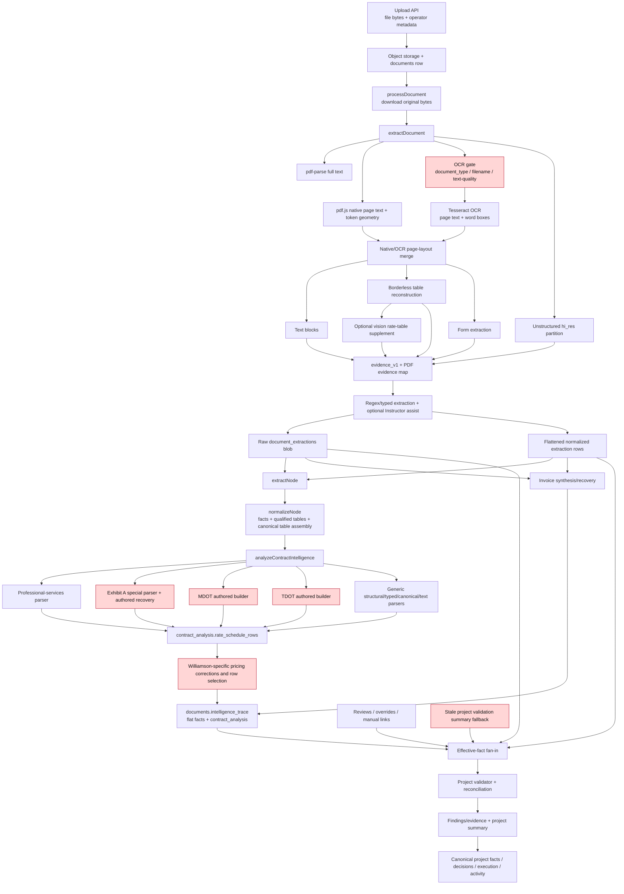

# OCR and Extraction Hardcoding Elimination — Phase 1 Audit

**Audit date:** 2026-07-23
**Status:** Phase 1 audit only. No production behavior, tests, fixtures, migrations, persisted data, or source documents were changed.
**Baseline:** `4dd1ed1cb9b8806be67a064c01f2c9d1d40a970a` on `main`
**Verdict:** **Fail — production-reachable hardcoded extraction and unsupported provenance exist.**

## 1. Executive conclusion

The confirmed TDOT Appendix B and MDOT Section 905 substitutions are active in the normal upload path. Genuine PDF/OCR/table extraction runs first, but `buildContractRateScheduleRows` can recognize the resulting document shape and replace parsed content with fully authored descriptions, units, quantities, rates, extensions, and categories. Those rows then enter `contract_analysis`, canonical facts, and validation as if they were extracted.

The audit also found production-reachable hardcoding outside the original MDOT/TDOT scope:

- Williamson Exhibit A authored recovery rows can emit descriptions, units, categories, and rates. One rate (`$80.00/Tree`) is explicitly emitted even though the code comments state that it does not appear in OCR.
- The contract-pricing assembler changes observed numeric values through a Williamson-specific correction map, including `18.80 → 13.50`, `8.25 → 3.25`, `96 → 95`, `318/816 → 315`, `26 → 25`, and `5 → 50`.
- Parsing and row survival depend on fixed pages, fixed table IDs, expected category counts, and Williamson-specific category/page relationships.
- OCR eligibility and document-family selection can depend on filenames, titles, and stored document types rather than the document image/text.
- Typed AI, vision recovery, invoice shadow evidence, normalized extraction rows, canonical trace facts, effective facts, and validation evidence do not maintain the required field-level page/bounding-box/raw-text/confidence/parser lineage. Some layers assign fixed or synthetic confidence and location.

Removing only the TDOT and MDOT arrays would therefore leave other extraction invention and document-specific behavior in production. Phase 2 must establish one source-grounded field contract across OCR, tables, typed extraction, canonical facts, overrides, and validation before Phase 3 removes the special builders.

## 2. Audit boundary and method

The audit traced:

1. upload and storage;
2. PDF text, layout, OCR, Unstructured, vision, and typed extraction;
3. evidence construction and raw extraction persistence;
4. pipeline extraction and normalization;
5. invoice, rate-schedule, and contract-intelligence builders;
6. canonical trace and fact persistence;
7. effective-fact resolution, validation, decisions, and audit events;
8. current tests, repair scripts, migrations, and relevant git history.

The review distinguishes:

- **source-derived heuristics:** generic parsing rules that transform observed tokens without selecting a document-specific output;
- **unsupported inference:** a value may be plausible but lacks field-level source proof;
- **hardcoded substitution:** code selects or authors a value based on a known document, page, fingerprint, name, ID, expected count, or correction table;
- **manual truth:** an operator-authored review, override, or link that is intentionally separate from machine extraction;
- **routing metadata:** file format/MIME routing is necessary; content-family routing based on a filename or project name is not document-only extraction.

## 3. Current extraction dependency graph



The red nodes are confirmed prohibited or unsafe substitution/routing points. Other nodes also have provenance and confidence defects described below.

## 4. Stage-by-stage audit

| Stage | Inputs | Outputs | Assumptions and heuristics | Confirmed hardcoding or document-specific behavior | Confidence and provenance |
|---|---|---|---|---|---|
| Upload | bytes, filename, title, operator-selected type/project | stored object and `documents` metadata | trusts supplied metadata | no expected extraction rows at upload | original bytes are retained; metadata is not document evidence |
| Process orchestration | document/storage rows and bytes | raw extraction, normalized rows, canonical trace | primary contract/invoice documents require canonical persistence | analysis mode can add metadata-informed AI decisions | extraction call has no stage timeout; later insert/canonical stages do |
| Native PDF text | bytes | full text, page text | readable text length/word thresholds | none specific to MDOT/TDOT | text confidence is structural, not token recognition confidence |
| PDF layout | bytes | pages, lines, tokens, coordinates | tokens are grouped by Y tolerance and classified by numeric/x-gap patterns | capped to 200 evidence pages | native tokens retain geometry, but downstream evidence drops full boxes |
| OCR | rendered pages | text, word boxes, average confidence | Tesseract PSM 11; whole-document OCR only after a weak-text gate | eligibility depends on document type or filename containing `contract`; targeted paths assume front pages 1–10 and rate pages 8–11 | OCR word confidence exists but is lost or averaged later |
| OCR/layout merge | native and OCR layouts | one merged layout | any native line makes the native page win | partial native text can suppress superior OCR layout | discarded OCR tokens and confidence cannot be recovered downstream |
| Table extraction | layout tokens/lines | `PdfTable` rows/cells | whitespace/x-band clustering, header aliases, numeric signals, continuation heuristics | page-local; headerless single-row tables can be flushed; reconstruction trigger expects dollar cells | cells retain x bounds only; y bounds and aligned-cell OCR confidence are lost |
| Unstructured | bytes | parsed elements | `hi_res`, external service, 45-second timeout | none specific found | element-type confidence is fixed; coordinate lineage remains separate from normal evidence |
| Vision supplement | OCR page image and a suspect table | four-column rate table | runs only when an already-found table has fewer than three headers and a `$digit` cell | authored headers; schema excludes quantity/extension | fixed `0.85`, page only, no field boxes/raw spans/per-field confidence; sequential and unbounded |
| Deterministic typed extraction | combined text/evidence/forms/tables | typed fields | regex candidates and fixed scoring; contract dates use early candidates | contractor-name canonicalization recognizes Aftermath; some filename/type routing determines family | text fallbacks can have empty evidence refs |
| Instructor assist | normalized/truncated text preview, labels, existing fields | missing typed fields | at most 8,000 characters; fills absent values | may infer from the presented text/schema, not known MDOT/TDOT rows | one global confidence; no page, box, raw span, parser proof; normalized persistence assigns fixed `0.7` |
| Evidence construction | text/tables/forms/elements | evidence objects | block/table-layer confidence reused for descendants | synthetic fallback can collapse content to page 1 | normal evidence location has no bbox; legacy page evidence uses fixed confidence |
| Raw persistence | extraction payload | `document_extractions.data` | latest blob is preferred later | repair scripts can overwrite known documents outside normal runtime | richest available payload, but not immutable per-field lineage |
| Normalized persistence | typed fields and evidence | scalar extraction rows | nested objects/arrays are selectively skipped/flattened | none specific found | assigns fixed confidence (`0.7`, `0.8`, `0.85`) and omits raw span/box/parser |
| `extractNode` | blob/scalars/related docs | evidence and extracted document | trusts detected/stored document type | metadata can choose the downstream family | appends legacy page evidence; typed fields can exist without matching evidence |
| `normalizeNode` | extracted document, tables, evidence | facts, qualified rate tables, canonical table assembly | score thresholds, header/unit/money patterns, minimum row support | synthetic invoice shadow evidence sets page 1/confidence 1; limited keys require citations | literal matching can attach a coincidental occurrence, not semantic field origin |
| Generic rate table qualification | reconstructed tables | accepted schedule fragments | at least two rows, score ≥ 6, money/unit/description signals | pass-through-only or one-row schedules can be rejected | qualification confidence is shape-driven |
| Contract rate builder | facts, typed rows, canonical rows, PDF tables | rate-schedule rows | prioritized parser dispatch | TDOT, MDOT, and Williamson substitutions execute before or alongside generic parsing | authored fields reuse row/page context rather than field proof |
| Pricing assembly | rate rows from several sources | operator-facing canonical pricing rows | categories, dedupe, readability, source-quality scoring | Williamson page/category/count/table-ID rules and numeric correction map | corrections can receive apparently improved display/confidence without proving replacement tokens |
| Contract intelligence | normalized document and related docs | `contract_analysis` | primary/related document relationships and operator page hints | incorporates authored rate rows | row evidence is not guaranteed field-granular |
| Invoice canonicalization | typed fields, evidence, text recovery | invoice and line rows | candidate scoring and quality-based line recovery | Aftermath contractor lookup; generic text recovery can replace typed lines | raw-text candidates may have no refs; later invoice shadow evidence is synthetic |
| Canonical persistence | pipeline result | `documents.intelligence_trace`, decisions/actions | rate rows copied into flat trace facts | carries every upstream substitution into canonical truth | field lineage is flattened; bounding boxes/stage/parser are not preserved |
| Effective facts | normalized rows, blobs, trace, reviews, overrides | winner/merged facts | scalar priority; arrays merged by row identity | stale persisted rows can survive array union; persisted rate rows can replace shorter reanalysis | returned record can inherit one source while evidence is flattened from several |
| Validation context | effective facts and trace | invoices, contract context, rate maps | prefer persisted trace; synthesize after human facts; project-summary fallback | may substitute persisted rows by row count; may use stale `validation_summary_json` | synthetic contract facts/document confidence 1; fallback confidence is fixed categorical mapping |
| Validation persistence | facts/context | runs, findings, evidence, summary | per-rule evidence projection | manual links can intentionally inject operator truth for validation only | evidence schema lacks bbox, raw-vs-normalized text, parser, stage, and confidence |
| Audit/project facts | validation results | activity, decisions, execution, canonical project view | aggregates validator summaries | no direct MDOT/TDOT extraction builder here | source extraction snapshot and field lineage are reduced to aggregate summaries |

## 5. Confirmed hardcoded extraction and routing findings

### F-01 — TDOT Appendix B complete authored schedule

- **Severity:** Critical
- **Status:** Current, production reachable
- **File/symbol:** `lib/contracts/contractRateScheduleRows.ts:67-100`, `TDOT_APPENDIX_B_SPECS`; detection/build at `:618-795`; dispatch at `:1617-1619`
- **Introducing commit:** `4e880627862c821d965b13273db993daee027233`
- **Mechanism:** 32 complete output rows are stored in source code. Fixed document-shape/page/row anchors recognize the schedule, after which the builder emits authored descriptions, units, origin/destination values, rates, raw rate strings, and categories.
- **Production reachability:** Normal upload → genuine extraction → normalized tables → contract intelligence → authored TDOT rows → trace/canonical facts → validation.
- **Classification:** Hardcoded extraction bypass. Source text is used as a fingerprint/anchor, not as the sole value source.

### F-02 — MDOT Section 905 complete authored schedule

- **Severity:** Critical
- **Status:** Current, production reachable
- **File/symbol:** `lib/contracts/contractRateScheduleRows.ts:102-189`, `MDOT_SECTION_905_PAGE` and `MDOT_SECTION_905_BID_SCHEDULE_SPECS`; gate/build at `:797-916`; dispatch at `:1609-1615`
- **Introducing commit:** `4e880627862c821d965b13273db993daee027233`
- **Mechanism:** page 193 and five full rows are authored in code, including descriptions, units, quantities, rates, extensions, categories, and regex fingerprints for the expected values.
- **Production reachability:** Same normal contract pipeline as F-01.
- **Classification:** Hardcoded extraction bypass.

### F-03 — Williamson Exhibit A authored recovery rows

- **Severity:** Critical
- **Status:** Current, production reachable
- **File/symbol:** `lib/contracts/contractRateScheduleRows.ts:191-376`, `EXHIBIT_A_TEXT_RECOVERY_SPECS`; `recoverMissingExhibitATextRows` at `:1028-1103`
- **Introducing commits:** `ca0cd746499b21cc05b00948c73e3748bec72715`, expanded by `4e880627862c821d965b13273db993daee027233`
- **Mechanism:** page, category, description, unit, and rate outputs are authored in a recovery table. At `:253-260`, the comment states that `$80.00` is absent from page-9 OCR and was manually confirmed by rendering the Williamson source; the function can nevertheless emit `$80.00/Tree`.
- **Production reachability:** Called by the normal Exhibit A schedule builder.
- **Classification:** Hardcoded extraction bypass. Corroboration patterns do not make an authored output source-derived; the `$80.00` case has no OCR token at all.

### F-04 — Williamson-specific value-changing correction map

- **Severity:** Critical
- **Status:** Current, production reachable
- **File/symbol:** `lib/contracts/contractPricingAssembly.ts:1054-1257`, `recoverKnownExhibitADisplayCorrection`; call at `:2032-2047`
- **Introducing commits:** primarily `ca0cd746499b21cc05b00948c73e3748bec72715` and `4e880627862c821d965b13273db993daee027233`
- **Mechanism:** page/category/description/value signatures overwrite observed data with authored values and descriptions. Confirmed examples include:

  | Observed/input signature | Authored output |
  |---|---|
  | page 8, rural row, `18.80` | rate `13.50`, authored route/description/unit |
  | page 8, final disposal, `8.25` | rate `3.25` |
  | page 9, tree row, `96` | rate `95` |
  | page 9, tree rows, `318` or `816` | rate `315` |
  | hanging-limb row with another rate | rate `80` |
  | waterways row, `26` | rate `25` |
  | white-goods row, `5` | rate `50` |

- **Production reachability:** Applied during assembly of every contract-pricing row.
- **Classification:** Hardcoded extraction substitution.

### F-05 — Williamson page/count/table-ID parser behavior

- **Severity:** High
- **Status:** Current, production reachable
- **Files/symbols:**
  - `lib/contracts/exhibitARateTableRows.ts:30`, `EXHIBIT_A_PAGES = {8,9,10,11}`
  - `lib/contracts/exhibitARateTableRows.ts:119-180`, page/category numeric normalization
  - `lib/contracts/exhibitARateTableRows.ts:501-516`, page-gated Exhibit A detection
  - `lib/contracts/exhibitARateTableRows.ts:693-700`, pages 8–11 excluded from the generic clean parser
  - `lib/contracts/contractPricingAssembly.ts:101-138`, Williamson-derived allowed categories, expected category counts, and page/category expectations
  - `lib/contracts/contractPricingAssembly.ts:1620-1625`, exact Williamson table IDs
  - `lib/contracts/contractPricingAssembly.ts:1774-1790`, expected-count row downgrading
- **Introducing commits:** primarily `ca0cd746499b21cc05b00948c73e3748bec72715`, later changes in `4e880627862c821d965b13273db993daee027233`
- **Mechanism:** page numbers and known table/count structure determine parsing, units, numeric shifts, acceptance, and row survival.
- **Production reachability:** Normal contract extraction and pricing assembly.
- **Classification:** Document-specific parsing. Some individual transformations resemble OCR heuristics, but their page/category/count scope is derived from one known document and fails table movement/reordering requirements.

### F-06 — Filename- and metadata-dependent OCR/classification

- **Severity:** High
- **Status:** Current, production reachable
- **Files/symbols:**
  - `lib/server/documentExtraction.ts:1316-1323`, `ocrEligible`
  - `lib/ai/instructor/classifyDocumentFamily.ts:73-95`, metadata haystack and stored-type precedence
  - `lib/documentIntelligence.ts:6714-6824`, filename/title routing, including Aftermath/Williamson at `:6804-6814`
- **Introducing commits:** OCR filename gate `c544f756bc0d4bfbbc1ea97224dcf6837d9e4ebc`; legacy routing `f5a7839c5735060e6d5b739e96fa78121c7c781d`
- **Mechanism:** whether OCR runs and which parser family handles a document can depend on `contract` or business-family words in filename/title, or operator/DB document type.
- **Production reachability:** Directly in every upload/reprocess.
- **Classification:** Prohibited extraction routing. MIME/extension selection for decoding is acceptable; semantic family selection from names is not.

### F-07 — Fixed OCR page targets

- **Severity:** High
- **Status:** Current production code
- **File/symbol:** `lib/server/documentExtraction.ts:1465-1563`
- **Introducing commit:** targeted attachment path originates in `f5a7839c5735060e6d5b739e96fa78121c7c781d`
- **Mechanism:** contract front matter is assumed to be within pages 1–10; a second path assumes rate attachments at pages 8–11 and requests `[1,2,8,9,10,11]`.
- **Production reachability:** Front-page path is reachable for eligible contracts. The rate-attachment condition appears difficult or impossible to reach after the preceding fallback branches because it requires `!didAttemptOcr && !meaningfulPdfText`; it remains executable production code and must not be retained as a design assumption.
- **Classification:** Document-layout-specific heuristic; incompatible with moving a table or arbitrary schedules.

### F-08 — Contractor-name lookup in canonical invoice extraction

- **Severity:** High under the stated invariant
- **Status:** Current, production reachable
- **File/symbol:** `lib/invoices/invoiceCanonicalNames.ts:6-25`, `normalizeInvoiceContractorDisplay` and `inferInvoiceContractorFromPlainText`
- **Introducing commit:** `46d000cb70445b9744a4288a5bfc19f39c0c4d61`
- **Mechanism:** the literal company name `Aftermath Disaster Recovery` is recognized and returned from a production lookup.
- **Production reachability:** Shared by invoice normalization and document intelligence.
- **Classification:** Contractor-specific lookup. Exact source text can safely be preserved; returning a canonical business name from a known-name branch is prohibited by the requested architecture unless represented as a separate, non-extraction entity-resolution layer.

### F-09 — Synthetic or unsupported evidence and confidence

- **Severity:** High
- **Status:** Current, production reachable
- **Files/symbols:**
  - `lib/pipeline/nodes/normalizeNode.ts:3876-3994`, invoice shadow evidence and assembly confidence
  - `lib/extraction/pdf/visionRateTableSupplement.ts:81-120`, fixed table confidence and no field boxes
  - `lib/server/extractionNormalizer.ts:96-179`, fixed normalized confidence and provenance loss
  - `lib/extraction/pdf/buildEvidenceMap.ts:22-137`, geometry dropped from standard evidence
  - `lib/pipeline/nodes/normalizeNode.ts:2701-2761`, opportunistic value-match attachment
  - `lib/validator/projectValidator.ts:294-349`, synthetic effective-fact evidence
- **Mechanism:** values may receive page 1, confidence 1, fixed layer confidence, or a coincidental literal match without a direct source span.
- **Production reachability:** Normal invoice, table, canonical, and validation flows.
- **Classification:** Not generally a hardcoded expected value, but it violates the required evidence invariant and can make unsupported output appear proven.

### F-10 — Persisted/stale output substitution during validation

- **Severity:** High
- **Status:** Current, production reachable
- **File/symbol:** `lib/validator/projectValidator.ts:1697-1800`
- **Mechanism:** the validator prefers persisted `documents.intelligence_trace.contract_analysis`; after human facts it can rebuild a synthetic document and substitute persisted rate rows when the persisted row count is larger; if document context is unavailable it can use `projects.validation_summary_json.contract_validation_context`.
- **Production reachability:** Normal project validation.
- **Classification:** Persistence recovery and validation-context substitution, not primary OCR. It can preserve hardcoded/stale rows after upstream code changes and must be replay-safe and source-snapshot-aware.

### F-11 — Manual review, override, and rate-link injection

- **Severity:** Informational if kept separate; High if mislabeled as extraction
- **Status:** Current, production reachable through explicit operator actions
- **Files/symbols:** fact review/override APIs; `lib/pipeline/documentPipeline.ts:124-146`; `lib/validator/projectValidator.ts:893-1073`
- **Mechanism:** reviewed JSON, overrides, and manual invoice-line rate links can author values used by canonical resolution or validation.
- **Production reachability:** Only after explicit user/operator action.
- **Classification:** Legitimate manual truth, not OCR. It must never be relabeled as machine extraction, merged into machine evidence, or used to train/repair extraction silently. The current effective-fact flattening does not preserve adequate row-level source attribution.

## 6. MDOT and TDOT data-lineage trace

### Current normal upload

```text
uploaded PDF bytes
  → pdf-parse / pdf.js / optional Tesseract / table reconstruction
  → raw extraction payload in document_extractions
  → extractNode + normalizeNode
  → analyzeContractIntelligence
  → buildContractRateScheduleRows
      MDOT: page/value fingerprint → MDOT_SECTION_905_BID_SCHEDULE_SPECS
      TDOT: split-table/page/row fingerprint → TDOT_APPENDIX_B_SPECS
  → contract_analysis.rate_schedule_rows
  → intelligence adapter copies rows into flat rate_table facts
  → documents.intelligence_trace
  → effective facts / persisted contract context
  → validation rate maps and findings
  → project validation summary / project facts / decisions
```

The uploaded document supplies the fingerprint and some source context, but the emitted business values come from source-code objects. This fails the requirement even when the hardcoded value happens to match the PDF.

### Non-runtime repair and migration paths

| Artifact | Introduced | Behavior | Classification |
|---|---|---|---|
| `scripts/reprocess-mdot-section-905-rate-rows.ts` | `fe3afbd13dee9e5bfe1cdab883a91cdd7d5ab3f3` | targets known MDOT document ID, asserts expected rows, and can persist reprocessed output | one-off repair; not a normal upload handler, but dangerous until generic replay replaces it |
| `scripts/reprocess-tdot-appendix-b-rate-rows.ts` | `75b2bb1ca8629abe07b0a39f3a61b80e5ebf9399` | targets known TDOT document ID and persists output | one-off repair |
| `scripts/reprocess-rate-category-null-documents.ts` | `3cd33468a7737a42a24eb2f782df4f6c8b7f215c` | targets both known IDs for category repair | one-off repair |
| `supabase/migrations/20260716000001_backfill_canonical_rate_row_count.sql` | `f3cff8b654409625c3d86125f0ab7d6638a516ea` | hardcodes the two document IDs and counts `32`/`5` | migration/data repair; not runtime extraction, but seeded canonical metadata |

These artifacts are not the root runtime bypass, but they can perpetuate or reassert its outputs during manual operations or deployment.

## 7. Generic table and OCR capability assessment

### What is already generic and reusable

- pdf.js supplies page/token geometry.
- Tesseract supplies word boxes and token confidence.
- Borderless table detection uses x bands, token gaps, header semantics, and continuation merging rather than drawn borders.
- Generic normalization exists for whitespace, currency parsing, units, header aliases, OCR punctuation, and category taxonomy.
- The canonical table adapter can accept structured rows from multiple source layers.
- Evidence IDs, gaps, node traces, and audit nodes provide a foundation for explicit lineage.

These components should be preserved where they transform observed source tokens without choosing document-specific values.

### Confirmed weaknesses

1. **OCR routing coverage:** scanned non-contract documents may never receive OCR because eligibility is metadata/filename gated.
2. **Page selection:** fixed page ranges fail moved or appended tables.
3. **Native/OCR arbitration:** a single native line blocks OCR geometry for the entire page.
4. **Merged cells:** reconstruction handles wrapped/continuation text heuristically but has no explicit rowspan/colspan representation.
5. **Subtables:** separation depends on header/noncandidate flushes rather than stable table-region geometry.
6. **Single-row/pass-through schedules:** row-count and money requirements can reject valid schedules.
7. **Malformed tables:** geometry reconstruction is narrowly triggered by dollar cells and small/sparse table shapes.
8. **Column roles:** the clean structural parser assumes the first four cells are description/unit/origin/rate and does not generically map quantity and extension.
9. **Cross-page tables:** extraction is page-local; known TDOT stitching compensates with a document-specific implementation.
10. **Vision schema:** only description/unit/origin/rate are returned; quantity, extension, cell boxes, raw cell strings, and per-field confidence are absent.
11. **Evidence geometry:** table cells expose horizontal bounds only; standard evidence exposes no box.
12. **Confidence:** table confidence is based on headers and row counts, not OCR certainty, geometry alignment, arithmetic consistency, or cross-parser agreement.

## 8. Provenance gap analysis

The requested minimum for every emitted value is:

```text
source_document_id
page
bounding_box
raw_text
normalized_value
confidence
parser / pipeline stage
```

No current end-to-end type carries that complete contract.

| Boundary | What survives | What is lost or synthesized |
|---|---|---|
| OCR token | page, x/y/width/height, text, word confidence | stable field identity and normalized value |
| PDF table cell | page/table/row/cell text, x min/max | y bounds; sometimes OCR confidence |
| Evidence map | document, page, block/table IDs, text, layer confidence | bbox; token/cell confidence; parser version |
| Typed AI | value and global assist confidence | raw span, page, bbox, per-field confidence, verified citation |
| Normalized extraction row | key/value/source label/fixed confidence | raw span, box, parser/stage, actual source confidence |
| Canonical fact/trace | flattened value and evidence IDs | field-level source span and transformation chain |
| Effective fact | winning/merged value and flattened evidence | per-row/per-field contributing source identity |
| Validation evidence | document/page/fact/field/value/note | bbox, raw text distinct from normalized value, confidence, parser/stage |
| Activity/project summary | aggregate finding/decision data | extraction snapshot and full lineage |

Consequently, the repository cannot currently prove that every emitted field came from the uploaded document even after the known arrays are removed.

## 9. Confidence model findings

Current confidence values mix incompatible meanings:

- Tesseract recognition confidence;
- PDF text-density/page-count heuristics;
- header/row-count table-shape scores;
- fixed vision confidence (`0.85`);
- fixed normalized typed-field confidence (`0.7`);
- fixed legacy page confidence (`0.55`);
- fixed/synthetic invoice and contract confidence (`1`);
- categorical rate-row mappings (`high = 0.9`, `medium = 0.75`, `needs_review = 0.45`, default `0.7`);
- optional Instructor global confidence.

A higher downstream number therefore does not reliably mean stronger source evidence. Phase 2 should define confidence as a structured assessment with at least:

1. recognition confidence from source tokens/cells;
2. geometry/column alignment confidence;
3. header-role confidence;
4. parse/normalization confidence;
5. arithmetic consistency for quantity × rate ≈ extension;
6. cross-engine agreement;
7. source completeness and ambiguity flags;
8. explicit uncertainty when no supporting span exists.

Hardcoded corrections must not participate in that model. A normalization may change formatting or a known OCR glyph only when the observed token and transformation are retained; it may not select a different business value.

## 10. Regression inventory and gaps

Current tests cover known/golden outputs, including exact MDOT/TDOT structures and Williamson correction behavior. They are useful for documenting historical behavior but currently protect the prohibited substitutions.

The suite does not establish the required metamorphic invariant:

> A controlled change in one source cell changes exactly the corresponding extracted field and does not require a code change.

Phase 5 must add source-level adversarial cases for:

- one changed rate, quantity, extension, unit, or description;
- one removed, inserted, duplicated, or reordered row;
- a table moved to another page;
- reordered columns and repeated headers;
- missing borders, merged description cells, multiline rows, and subtables;
- a single-row schedule and pass-through-only schedule;
- partial native text with better OCR geometry;
- conflicting OCR/vision candidates;
- a field absent from all source layers, which must remain absent/uncertain;
- old MDOT/TDOT/Williamson fingerprints with altered values, proving no historical value is injected.

Test fixtures may contain expected outputs, but production modules must not import them and the assertions must be computed solely from mutated source documents.

## 11. Performance and reliability implications

The generic replacement will increase extraction work unless bounded deliberately:

- full-document Tesseract currently renders at scale 2 and recognizes pages sequentially, without an OCR-specific timeout or page cap;
- vision recovery is sequential and has no timeout;
- Instructor can retry up to three calls and has no request timeout;
- pdf-parse and pdf.js layout have no extraction-stage timeout;
- Unstructured is the only upstream engine with a 45-second abort;
- the outer `extractDocument` call is not wrapped by a stage timeout;
- multiple `ArrayBuffer` clones and simultaneous representations increase memory use;
- validation loads full trace/blob data and duplicates rate rows into project summaries;
- validation persistence performs repeated per-finding writes;
- large-project background routing considers ticket/load counts, not extraction byte size, page count, table count, or fact count.

Phase 2 should budget per page/stage, cap concurrency, preserve partial results with explicit gaps, stream or batch long documents, cache immutable page artifacts by source hash and parser version, and record timing/cost diagnostics. Performance optimization must not drop provenance or reintroduce shortcuts.

## 12. Git-history findings

The earlier full-history audit traversed all reachable refs and found no older deleted or reverted MDOT/TDOT mapping before the current implementation. The significant commits are:

| Commit | Finding |
|---|---|
| `ca0cd746499b21cc05b00948c73e3748bec72715` | introduced the Williamson Exhibit A special parser, recovery values, and much of the pricing correction architecture |
| `c544f756bc0d4bfbbc1ea97224dcf6837d9e4ebc` | added filename-dependent OCR eligibility |
| `46d000cb70445b9744a4288a5bfc19f39c0c4d61` | added Aftermath contractor canonicalization/inference |
| `4e880627862c821d965b13273db993daee027233` | introduced MDOT/TDOT expected-row arrays/builders and expanded Williamson recovery/corrections |
| `bf763fe8fe34af9caad181fc4e7636e9c362f5c2` | changed dispatch so TDOT-specific stitching precedes the generic structural parser |
| `fe3afbd13dee9e5bfe1cdab883a91cdd7d5ab3f3` | added known-ID MDOT reprocessing |
| `75b2bb1ca8629abe07b0a39f3a61b80e5ebf9399` | added known-ID TDOT reprocessing |
| `3cd33468a7737a42a24eb2f782df4f6c8b7f215c` | added known-ID MDOT/TDOT category repair |
| `f3cff8b654409625c3d86125f0ab7d6638a516ea` | added known-ID/count canonical row-count backfill |

No production import from a fixture/test directory was found for the confirmed paths. The runtime problem resides directly in production modules.

## 13. Phase 2 architecture requirements

Phase 2 should design—not yet implement—the following boundary:

```text
SourceArtifact
  → PageArtifact
  → Token/Cell/RegionArtifact
  → FieldCandidate
  → VerifiedField
  → CanonicalFact
```

Each transition must be deterministic and append-only:

- `SourceArtifact`: immutable file hash, storage version, MIME determined from bytes where possible.
- `PageArtifact`: page image/text layers and engine/version identities.
- `Token/Cell/RegionArtifact`: normalized page box, raw text, engine confidence, parent table/row/cell.
- `FieldCandidate`: semantic role, parsed value, transformation steps, source fragment IDs, parser/version.
- `VerifiedField`: field-level source checks, ambiguity, confidence components, rejection reasons.
- `CanonicalFact`: normalized value plus immutable dependency references; no value without verified source fragments, except an explicitly labeled human assertion or deterministic derived fact whose input dependencies are cited.

The design must also:

- perform OCR based on measurable per-page quality, for every document family;
- arbitrate native/OCR/vision per region rather than per whole page;
- discover tables on all pages and map column roles from headers/geometry;
- represent merged/multiline cells and cross-page continuation explicitly;
- parse rows independently and allow partial/uncertain rows;
- never depend on filename, project, document ID, invoice/contract number, contractor, fixed page, fixed table ID, expected row count, or known output;
- preserve machine extraction, deterministic derivation, and human correction as distinct provenance classes;
- invalidate/replay persisted traces by source hash and parser version so stale hardcoded rows cannot survive.

## 14. Remaining unknowns

- The original TDOT and MDOT source PDFs are not present in the repository, so Phase 1 cannot independently re-extract or produce the required old-vs-new field comparison.
- Repository code cannot prove which historical script or migration was executed in each deployed database, nor which persisted traces still contain authored rows.
- External service configuration, model versions, prompt responses, production timeouts, and OCR language assets are environment-dependent.
- The attached prior audit established current MDOT/TDOT examples; this phase did not query live Supabase or mutate/reprocess production data.
- The reachability of the fixed `[1,2,8,9,10,11]` attachment OCR branch should be confirmed with instrumentation or a targeted test; its condition appears contradictory after earlier branches.
- Manual reviews and overrides may contain legitimate operator truth. They require source-class separation, not automatic deletion.

## 15. Phase 1 verification and exit criteria

Verification performed:

```powershell
git status --short
rg and source inspection across app/api, lib/server, lib/extraction, lib/pipeline,
lib/contracts, lib/invoices, lib/validator, scripts, supabase/migrations, and tests
git log -S
git log -G
git log --all -- <path>
git show
git blame
git diff --check
```

No runtime tests were required for this documentation-only phase. Phase 1 is complete when this audit is committed alone and the worktree is clean.

Phase 2 must be reviewed and approved before implementation. It should resolve the field-provenance schema, source/human truth separation, stale-trace replay policy, generic table model, confidence semantics, and performance budgets. Only then should Phase 3 remove the production-specific builders and correction paths.
